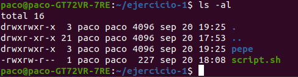
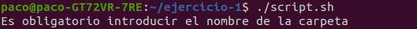
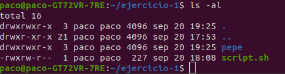
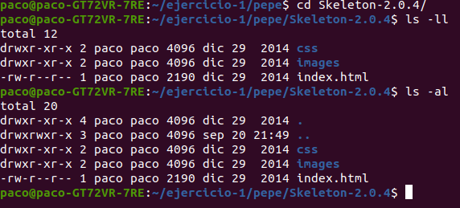

# Ejercicio-uno

- [Ejercicio-uno](#ejercicio-uno)
  - [**Creación de carpetas y archivo**](#creación-de-carpetas-y-archivo)
  - [**Edición del script**](#edición-del-script)
  - [**Permisos y Ejecución del script**](#permisos-y-ejecución-del-script)

## **Creación de carpetas y archivo**
Comenzamos abriendo una term`inal y nos dirigimos al directorio en el cual vamos a trabajar (en mi caso en la ruta `/home/paco`) y procedemos:

~~~
$ mkdir ejercicio-1
~~~
Esto nos creará la carpeta **ejercicio-1**.

Entramos en la carpeta recién creada:
~~~
$ cd ejercicio-1
~~~

Es momento de crear nuestro **script de bash**. Para ello introducimos el siguiente comando, que nos creará el archivo y entrará directamente al archivo para editarlo.

~~~
$ nano script.sh
~~~

La ruta absoluta del script nos habrá quedado de esta forma: `home/mi-usuario/ejercicio-1/script.sh`

## **Edición del script**
Una vez dentro del archivo, escribiremos las siguientes líneas de código:
~~~
#!/bin/bash

if [ $# -eq 1 ]
then
  mkdir $1
  cd $1
  wget https://github.com/dhg/Skeleton/releases/download/2.0.4/Skeleton-2.0.4.zip
  unzip Skeleton-2.0.4.zip
else
  echo Es obligatorio introducir el nombre de la carpeta
fi
~~~ 
Guardamos el script con la combinación **"CRTL + O"** y salimos del mismo con la combinación **"CRTL + X"**.

A continuación desglosado el funcionamiento del script:
1. La instrucción `#!/bin/bash` indica el tipo de intérprete que vamos a usar, esta instrucción debe ir **siempre** en primer lugar.
2. El bloque de código `if [ $# -eq 1 ]` está indicando que si el total de parámetros (`$#`) que le hayamos pasado es igual (`-eq`) a `1`, ejecutará lo que haya dentro del `then`, en el caso contrario lo que haya en el `else`.
3. En caso afirmativo, creará el directorio con el nombre que se le haya pasado como parámetro `mkdir $1`, accederá al interior de ese directorio `cd $1`, descargará el archivo de la url que le indicamos `wget "url-archivo"` y descomprimirá el archivo en la misma carpeta con la instrucción `unzip "nombre-archivo"`.
4. En caso que no se cumpla la condición, se ejecutará la parte del `else` y enviará un mensaje por consola gracias a la instrucción `echo Es obligatorio introducir el nombre de la carpeta`.
   

## **Permisos y Ejecución del script**
Para proceder a ejecutar el script, debemos primero **comprobar que poseemos los permisos** para poder ejecutarlo.

~~~
$ ls -al
~~~

En la imagen que hay a continuación podemos observar que el archivo sólo tiene permisos de edición, borrado.. (representados con una `w`) y permisos de lectura (representados con una `r`) con lo que si probamos a ejecutarlo:

~~~
$ ./script.sh
~~~

Podemos observar que tenemos denegado el acceso.

Procedemos a darle permisos de ejecución al archivo para nuestro usuario.

~~~
$ chmod 764 script.sh
~~~

Y comprobamos si hemos efectuado correctamente la modificación:

~~~
$ ls -al
~~~

Ya poseemos permisos de ejecución, proceemos a ejecutar el script:

~~~
$ ./script.sh
~~~

Recibimos el mensaje de que no hemos introducido ningún parametro. Probamos de nuevo:

~~~
$ ./script.sh pepe
~~~

Comprobamos el directorio:

~~~
$ ls -al
~~~

Vemos que la carpeta `pepe` ya existe. Accedemos a su interior y miramos lo que hay dentro del directorio:

~~~
$ cd pepe
$ ls -al
~~~

El script ha funcionado correctamente, observamos que se encuentra el archivo `*.zip` y también el directorio con el contenido descomprimido.

Entramos en el subdirectorio creado:
~~~
$ cd Skeleton-2.0.4/
$ ls -al
~~~

