# **Ejercicio 2**
- [**Ejercicio 2**](#ejercicio-2)
    - [**Creando estructura y configurando el script**](#creando-estructura-y-configurando-el-script)
      - [**Crear directorio**](#crear-directorio)
      - [**Editar script**](#editar-script)
    - [**Iniciación a Git**](#iniciación-a-git)
      - [**Instalación Git (opcional)**](#instalación-git-opcional)
      - [**Configurar Git**](#configurar-git)
      - [**Iniciar repositorio local**](#iniciar-repositorio-local)
      - [**Creación archivo README y directorio img**](#creación-archivo-readme-y-directorio-img)
    - [**GitHub**](#github)
      - [**Creación del repositorio GitHub**](#creación-del-repositorio-github)
      - [**Configuración conexión y autenticación GitHub**](#configuración-conexión-y-autenticación-github)
      - [**Configuración repositorio local y remoto**](#configuración-repositorio-local-y-remoto)
      - [**Acceso al repositorio desde otro ordenador/usuario**](#acceso-al-repositorio-desde-otro-ordenadorusuario)

### **Creando estructura y configurando el script**

#### **Crear directorio**
En primer lugar nos disponemos a crear el directorio en el lugar deseado:
~~~
$ mkdir ~/ejercicio-2/
~~~

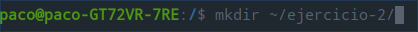

El siguiente paso es reutilizar el script del ejercicio anterior, para ello realizaremos una copia al nuevo directorio: 
~~~
$ cp ~/ejercicio-1/script.sh ~/ejercicio-2/script.sh
~~~
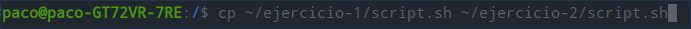

Comprobamos el resultado:
~~~
$ cd ~/ejercicio-2/
$ ls -al
~~~
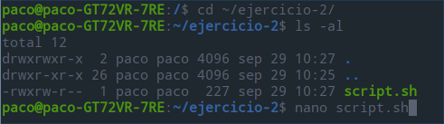

#### **Editar script**
Editamos el script:
~~~
$ nano script.sh
~~~
Una vez dentro escribiremos la estructura que deseamos para la página web, en este caso vamos a crearlo mediantes las intrucciones **touch** para crear archivos y **mkdir** para directorios:

1. Un index.html 
2. Un subdirectorio `css` y dentro el archivo `styles.css`.
3. Y otro subdirectorio `js` con el archivo `main.js` dentro.

Resultado:

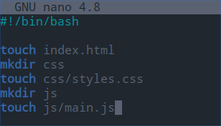

**CRTL+O** para guardar y **CRTL+X** para salir del script.

En el caso de que no hayamos copiado y editado el script del ejercicio anterior, deberiamos de proceder a darle permisos de ejecución al script mediante la instrucción **chmod**.

Ejecutamos el script y comprobamos el resultado navegando por los directorios
~~~
$ cd nombre-directorio
~~~
Y ejecutando lo siguiente para comprobar su contenido:
~~~
$ ls -al
~~~

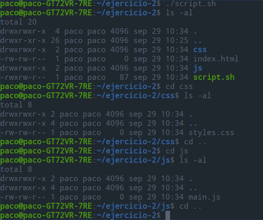

Borramos el script del directorio:
~~~
rm script.sh
~~~
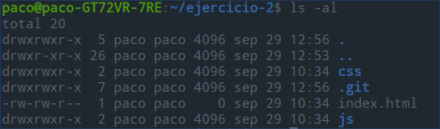

### **Iniciación a Git**

#### **Instalación Git (opcional)**
Para comprobar si tenemos instalado Git, introduciremos el comando siguiente:
~~~
$ git --version
~~~
En el caso de que no lo tengamos, nos devolverá un mensaje con el aviso de que no se ha encontrado la orden `git`.
    
Procedemos a instalarlo, aunque este paso puede variar del sistema operativo en el que estemos trabajando o de nuestra distribución, desde Ubuntu escribimos en Terminal el comando siguiente:

~~~
$ sudo apt install git
~~~

Comprobamos:
~~~
$ git --version
~~~
Y nos aparecerá la versión que tenemos instalada.

#### **Configurar Git**

Para poder trabajar con git hay que configurar al menos nuestro nombre de **usuario** y nuestro **email**.

1. Configuramos nuestro nombre de usuario (sin comillas, sin espacios y en minúscula): 
~~~
$ git config --global user.name "mi-usuario"
~~~
1. Configuramos nuestro email (sin comillas, sin espacios y en minúscula):
~~~
$ git config --global user.email "mi-email"
~~~
3. Comprobar lo configurado anteriormente:
~~~
$ git config --global --list
~~~
Si todo está correcto nos aparecerá nuestro username y el email.
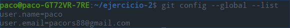

#### **Iniciar repositorio local**
Es importante asegurarse de que estamos en el path correcto, para ellos introducimos en la terminal:
~~~
$ pwd
~~~
Si estamos en el directorio deseado, comenzamos:
~~~
$ git init
~~~
Recibiremos el mensaje `Inicializado repositorio Git vacío en "nuestra-ruta"`

Ahora todo nuestro directorio (ejercicio-2 en mi caso) se ha convertido en un repositorio **local** git. En el caso de que le hubieramos pasado el nombre de una carpeta como parámetro, sólo se habría creado el repositorio de esa carpeta y no todo el directorio. Esto nos creará un archivo oculto `.git` que será el encargado de controlar y gestionar el repositorio.

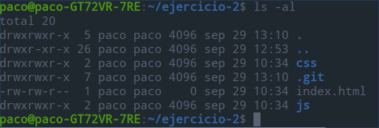

Finalmente creamos agregamos todo el contenido de la carpeta:
~~~
$ git add .
~~~

Y generamos nuestro primer commit:
~~~
$ git commit -am "primmer commit"
~~~

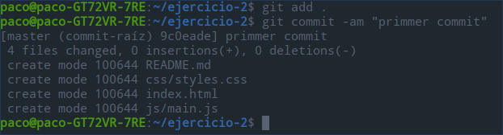
#### **Creación archivo README y directorio img**
Por último creamos el archivo `README.md`, que es este mismo archivo que estás leyendo para adjuntar la documentación y la carpeta `img` que utilizaremos para las imágenes adjuntas.

Ahora si realizamos un git status, nos avisará de que no hay nada para hacer commit, señal de que se ha relizado correctamente.

~~~
$ touch README.md
~~~
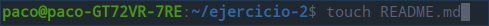
~~~
$ mkdir img
~~~
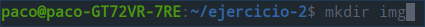
~~~
$ ls -al
~~~
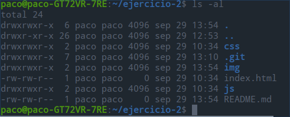

### **GitHub**

#### **Creación del repositorio GitHub**
Para crear un repositorio se puede realizar tanto por la línea de comandos como por su web, pero cómo todavía no tenemos sincronizado nuestro usuario con **GitHub**, procedemos a realizarlo mediante su página web.

Accedemos a nuestra cuenta de **GitHub** y buscamos la pestaña repositorios, y pulsamos en `New`.

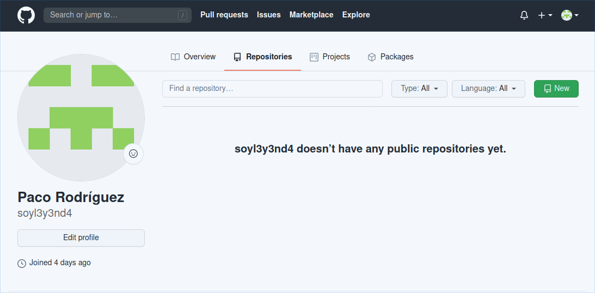

Elegimos el nombre para nuestro repositorio, una descripción opcional, sleccionamos `Public` y los 3 checkboxes siguientes (Add a README.file, Add.gitignore, Choose a license) los dejamos deshabilitados y pulsamos a `Create repository`.

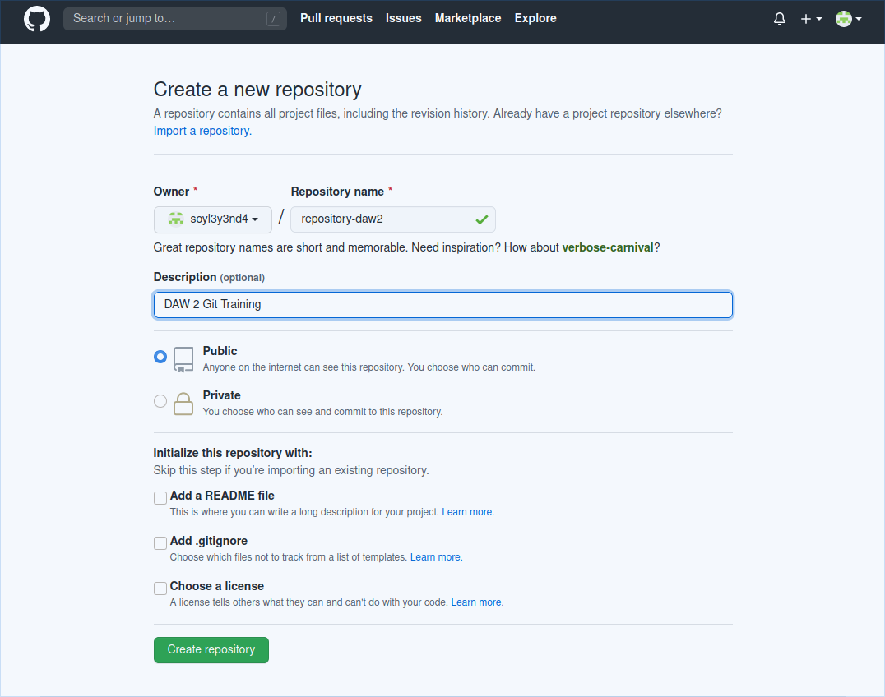

Acto seguido nos aparecerán varias líneas de comando, debemos copiar y guardar a buen recaudo la que va a continuación del texto `...or push an existing repository from the command line`, que nos permitirá añadir nuestro repositorio local, al repositorio Git una vez tengamos configurada la cuenta correctamente, paso que veremos a continuación.

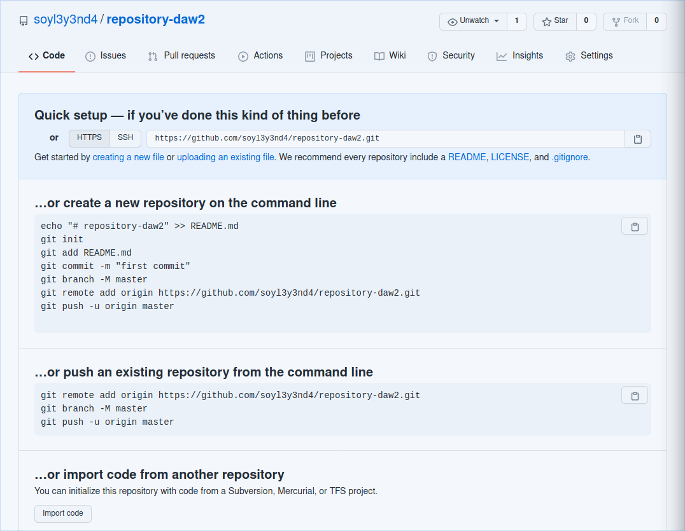

#### **Configuración conexión y autenticación GitHub**

Antes de añadir el repositorio que hemos creado, debemos de autenticarnos para que GitHub reconozca el ordenador desde el que estamos accediendo, para ello debemos realizar varios pasos:

1. Nos ubicamos en el directorio raíz de nuestro usario y creamos una carpeta con el nombre .ssh y accedemos a la carpeta.
   
~~~
$ cd ~
$ mkdir .ssh
$ cd .ssh
~~~

1. Una vez dentro debemos generar una clave que irá asociada a nuestro email.
   
~~~
$ ssh-keygen -t rsa -C pacors88@gmail.com
~~~

1. Nos preguntará donde queremos guardar la clave generada, la dejamos por defecto y la passphrase o bien la podemos dejar vacía o a nuestra elección.

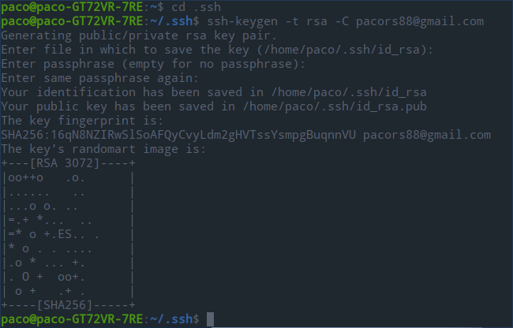

4. Observamos el contenido del directorio y accedemos al archivo `id_rsa.pub` que contiene nuestra clave pública, la cuál copiaremos para pegar en nuestra cuenta de GitHub, podemos abrir el archivo con cualquier editor, en este caso la abrimos con `LibreOffice` porque es más sencillo de copiar que con el editor `nano`.
   
~~~
$ ls -al
$ xdg-open id_rsa.pub
~~~

1. Accedemos a nuestro perfil de GitHub, vamos a `Settings` y después a `SSH and GPG keys` y hacemos click en `New SSH key`.

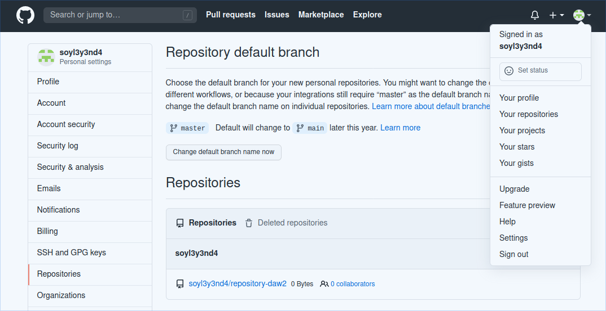

6. Introducimos un identificador para el ordenador y pegamos la clave pública extraida de `id_rsa.pub`.

Si hemos realizado todo correctamente, se nos habrá añadido una SSH key.

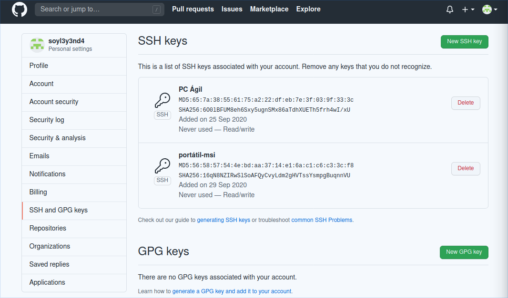

#### **Configuración repositorio local y remoto**

Ahora vamos a introducir en la terminal los comandos que hemos copiado al crear el repositorio mediante la web de GitHub.

~~~
$ git remote add origin https://github.com/soyl3y3nd4/repository-daw2.git
$ git branch -M master
$ git push -u origin master
~~~

Si nos dirigimos a nuestro repositorio podemos comprobar que se han añadido los archivos que tenemos en el repositorio local Git.

Ahora vamos a añadir el archivo README.md, en este caso el mismo en el que estamos escribiendo esta documentación y después comprobaremos con `git status` los cambios, realizaremos un `commit` y finalmente un `git push` para subir al repositorio remoto los cambios:
~~~
$ cp ~/test/README.md ~/ejercicio-2/README.md
$ cd ejercicio-2
$ git status
$ git commit -am "segundo commit"
~~~

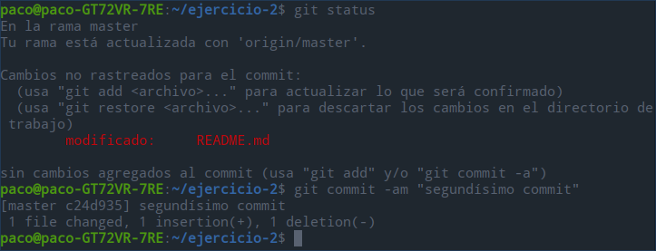

Accedemos a nuestro repositorio `GitHub` y si ha ido todo bien ya tendremos el archivo `README` en el repositorio remoto.

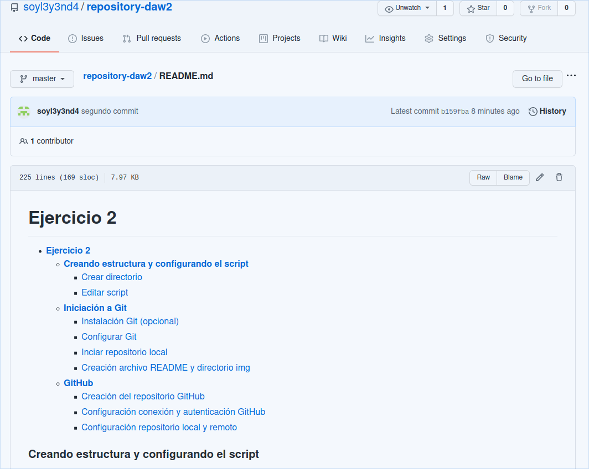

#### **Acceso al repositorio desde otro ordenador/usuario**

En mi caso he accedido desde otro ordenador pero esta vez con Windows. He procedido a instalar GitHub desde su página web y después he realizado todo el proceso desde su `BASH`.

He tenido que volver a realizar todo el proceso descrito anteriormente ya que era una instalación nueva, aquí un breve repaso:
~~~
$ git config --global user.name "mi-usuario"
$ git config --global user.email "mi-email"
$ mkdir ~/.ssh
$ cd ~/.ssh
$ ssh-keygen -t rsa -C “mi-email”
~~~
Y agregamos a GitHub la clave publica generada en el archivo `id_rsa.pub`.

Después nos dirigimos al directorio deseado y creamos la carpeta `daw`:
~~~
$ mkdir daw
$ cd daw
~~~

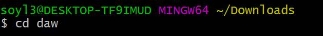
Una vez dentro de la carpeta clonamos el repositorio remoto.

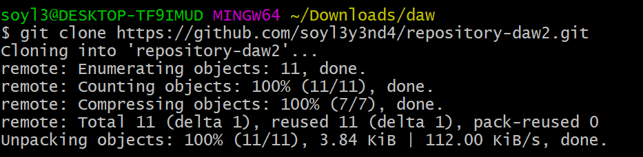

~~~
git clone https://github.com/soyl3y3nd4/repository-daw2.git
~~~

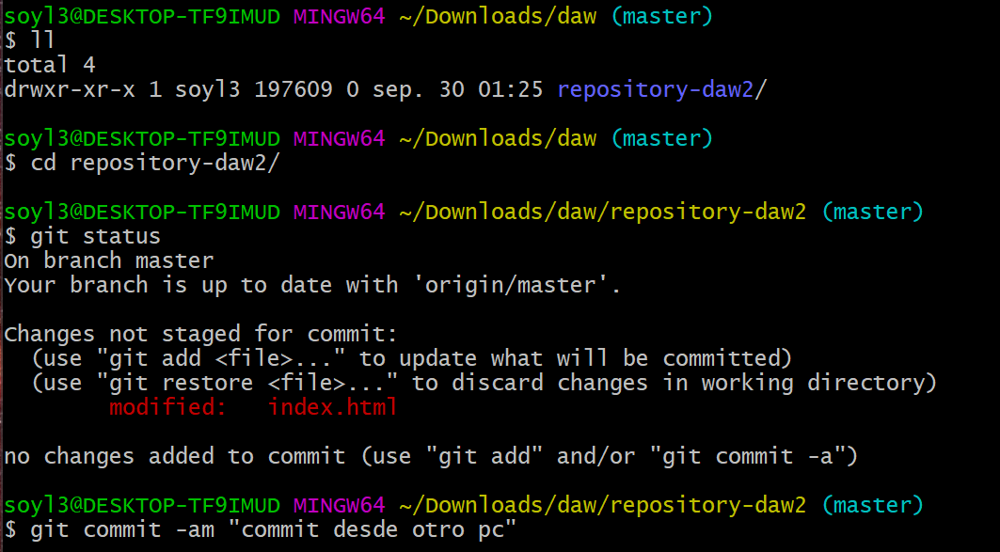
Ahora se nos creará una carpeta con el nombre del repositorio.
Modificamos cualquier archivo, en mi caso el index.html, comprobamos mediante un `git status` si ha habido cambios, crearemos un **commit** y haremos un **push**.
~~~
$ git status
$ git commit -am "commit desde otro pc"
$ git push
~~~
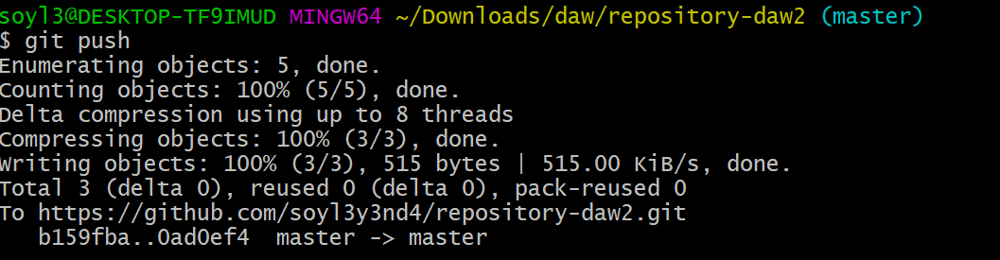

Por último desde el ordenador del cuál hemos generado todo el contenido accedemos de nuevo a la carpeta de nuestro repositorio local y realizamos un **pull** para actualizar nuestro repositorio local.

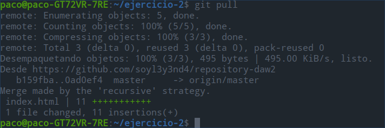

