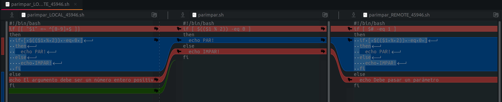

## Sistemas de control de versiones - GIT

### Introducción

### Comandos básicos

~~~
git config --global --list                      
git config --global user.name USUARIO
git config --global user.email EMAIL
git init
git add
git commit
git push
git pull
~~~

### Repositorios remotos (Github)

Crear cuenta en `github`

### Trabajando con ramas

Cualquier sistema de control de versiones moderno tiene algún mecanismo para soportar el uso de ramas. Cuando hablamos de ramificaciones, significa que tú has tomado la rama principal de desarrollo (master) y a partir de ahí has continuado trabajando sin seguir la rama principal de desarrollo.

Git almacena los datos como una serie de instantáneas (copias puntuales de los archivos completos, tal y como se encuentran en ese momento). En cada confirmación de cambios (commit), Git almacena una instantánea de tu trabajo preparado. Dicha instantánea contiene además unos metadatos con el autor y el mensaje explicativo, y uno o varios apuntadores a las confirmaciones (commit) que sean padres directos de esta (un padre en los casos de confirmación normal, y múltiples padres en los casos de estar confirmando una fusión (merge) de dos o más ramas).

Vamos a desarrollar un ejemplo paso a paso. Nos han encargado crear un script de `bash` que nos diga si el número que pasamos como parámetro es par o impar. Em primer lugar creamos una carpeta para desarrollar el proyecto, e inicializamos un repositorio local de `git`:

~~~
$ mkdir daw_ejemplo
$ cd daw_ejemplo
$ git init
~~~

Una vez inicializado el repositorio, vamos a crear el script `parimpar.sh`:

~~~
$ nano parimpar.sh
~~~

con este contenido:

~~~
#!/bin/bash
if [ $(($1 % 2)) -eq 0 ]
then
  echo PAR!
else
  IMPAR!!
fi
~~~

Probamos el script pasándole un número como parámetro. Vemos que funciona correctamente, así que guardamos los cambios (`commit`):

~~~
$ git add parimpar.sh
$ git commit -m "version 1.0"
~~~

comprobamos que el árbol de trabajo está limpio (`git status`) y nos vamos a casa felices.

~~~
$ git status
On branch master
nothing to commit, working tree clean
~~~

Al día siguiente nos está esperando el/la jefe/a. Resulta que hay dos *bugs* en nuestro script y hay que arreglarlos cuanto antes. Los llamaremos `bug 1` y `bug 2`:

- `bug 1`: Si introduzco un parámetro distinto de un número entero debería mostrar un error.
- `bug 2`: El script debe comprobar el número de parámetros recibidos. Si no se pasa ninguno debe mostrar un mensaje informativo.

Os asignan a ti y a un/una compañero/a para resolver los *bugs*. Cada uno de ellos debe ser resuelto en una rama y luego debe ser integrado en la rama principal `master`. Ok, vamos con el primer *bug*. Primero creamos una rama nueva. La llamaremos `bug_1`:

~~~
$ git branch bug_1
~~~

Con esta instrucción hemos creado una nueva rama. Si queremos trabajar en ella tenemos que activarla:

~~~
$ git checkout bug_1
$ git status
On branch bug_1
nothing to commit, working tree clean
~~~

Ahora estamos trabajando en la rama `bug_1`. Esto quiere decir que todos los cambios y *commits* que hagamos en el proyecto van a ocurrir sólamente en esta rama, la rama *master* permanecerá intacta. Vamos a resolver el *bug* 1:

~~~
#!/bin/bash
if [[ "$1" =~ ^[0-9]+$ ]]
then
  if [ $(($1 % 2)) -eq 0 ]
  then
    echo PAR!
  else
    IMPAR!!
  fi
else
  echo El argumento debe ser un número entero positivo
fi
~~~

Guardamos los cambios en el script y comprobamos que funciona correctamente. Hacemos un `commit` con los cambios y el mensaje `bugfix: bug 1`:

~~~
$ git commit -am "bugfix: bug 1"
~~~

Si miramos el `log`, vemos que tenemos el `commit` inicial y el que acabamos de hacer:

~~~
$ git log
commit 9fa6dbec77fcfa0953a06a65a990601f9091b831 (HEAD -> bug_1)
Author: Emilio Sansano <esansano@uji.es>
Date:   Thu Oct 1 14:10:17 2020 +0200

    bugfix: bug 1

commit e6d5f9bb2be15ad6710077f829821766acb5844a (master)
Author: Emilio Sansano <esansano@uji.es>
Date:   Thu Oct 1 09:50:28 2020 +0200

    version 1.0
~~~

Ok, ahora vamos a simular que somos el otro trabajador, y vamos a arreglar el *bug* 2 a partir de la rama `master`. Para ello seguimos el mismo proceso que antes, creamos una nueva rama llamada `bug_2` y la activamos. Antes de ello debemos situarnos en la rama `master`:

~~~
$ git checkout master
~~~

Ahora estamos de nuevo en la rama `master`. Podemos comprobarlo con `git status`:

~~~
$ git status
On branch master
nothing to commit, working tree clean
~~~

Recordemos que en esta rama no hemos efectuado ningún cambio, por lo tanto el script está en el estado correspondiente al último `commit` en esta rama:

~~~
$ cat cat ./parimpar.sh
#!/bin/bash
if [ $(($1 % 2)) -eq 0 ]
then
  echo PAR!
else
  echo IMPAR!
fi
~~~

Vamos con el *bug* 2. Creamos la nueva rama, la activamos y hacemos las modificaciones pertinentes. Otra manera de crear una rama y activarla directamente es usando el parámetro `-b` en el comando `checkout`. Para crear la rama y activarla a la vez, hacemos lo siguiente:

~~~
$ git checkout -b bug_2
~~~

comprobamos que estamos en la rama adecuada:
~~~
$ git status
On branch bug_2
nothing to commit, working tree clean
~~~

también podemos hacerlo con la instrucción `git branch` o `git branch -a`, que nos mostrará una lista con todas las ramas existentes y una marca en la rama activa:

~~~
$ git branch
  bug_1
* bug_2
  master
~~~

ahora modificamos el script original para solventar el *bug* 2:

~~~
#!/bin/bash
if [ $# -eq 1]
then
  if [ $(($1 % 2)) -eq 0 ]
  then
    echo PAR!
  else
    echo IMPAR!
  fi
else
  echo Debe pasar un parámetro
fi
~~~

comprobamos que funciona y hacemos `commit` de los cambios con el mensaje `bugfix: bug 2`:

~~~
$ git commit -am "bugfix: bug 2"
~~~

Si ahora hacemos `git log` en esta rama, veremos que tenemos el `commit` inicial y el que acabamos de hacer:

~~~
$ git log
commit 1305211bf85934334c42dd7fd4caa6f0ff05850a (HEAD -> bug_2)
Author: Emilio Sansano <esansano@uji.es>
Date:   Thu Oct 1 17:25:53 2020 +0200

    bugfix: bug 2

commit e6d5f9bb2be15ad6710077f829821766acb5844a (master)
Author: Emilio Sansano <esansano@uji.es>
Date:   Thu Oct 1 09:50:28 2020 +0200

    version 1.0
~~~

#### Imtegrando cambios con `git merge`

Una vez areglados los *bugs* en las ramas correspondientes, vamos a integrar los cambios en la rama principal. Para ello volvemos a la rama `master` e integramos los cambios realizados en la rama `bug_1` usando el comando `git merge`:

~~~
$ git checkout master
$ git merge bug_1
Updating e6d5f9b..9fa6dbe
Fast-forward
 parimpar.sh | 12 +++++++++---
 1 file changed, 9 insertions(+), 3 deletions(-)
~~~

Si inspeccionamos el contenido del script, vemos que los cambios se han integrado correctamente:

~~~
$ cat parimpar.sh
#!/bin/bash
if [[ "$1" =~ ^[0-9]+$ ]]
then
  if [ $(($1 % 2)) -eq 0 ]
  then
    echo PAR!
  else
    echo IMPAR!
  fi
else
echo El argumento debe ser un número entero positivo
fi
~~~

si inspeccionamos el *log*, vemos que las dos ramas, `master` y `bug_1` se encuentran en el mismo *commit*:

~~~
commit 9fa6dbec77fcfa0953a06a65a990601f9091b831 (HEAD -> master, bug_1)
Author: Emilio Sansano <esansano@uji.es>
Date:   Thu Oct 1 14:10:17 2020 +0200

    bugfix: bug 1

commit e6d5f9bb2be15ad6710077f829821766acb5844a
Author: Emilio Sansano <esansano@uji.es>
Date:   Thu Oct 1 09:50:28 2020 +0200

    version 1.0
~~~

ahora vamos a integrar el trabajo hecho en la rama `bug_2`. Al intentarlo vemos que hay un conflicto:

~~~
$ git merge bug_2
Auto-merging parimpar.sh
CONFLICT (content): Merge conflict in parimpar.sh
Automatic merge failed; fix conflicts and then commit the result.
~~~

Ha habido un conflicto al intentar integrar los cambios en la rama principal. Los dos programadores han realizado cambios en el mismo archivo y en las mismas líneas, y `git` no puede resolver estor conflictos automáticamente. Cuando esto ocurre hay que editar manualmente los archivos afectados. Si miramos ahora el contenido del script, vemos que hay una serie de anotaciones:

~~~
$ cat parimpar.sh
#!/bin/bash
<<<<<<< HEAD
if [[ "$1" =~ ^[0-9]+$ ]]
=======
if [ $# -eq 1 ]
>>>>>>> bug_2
then
  if [ $(($1 % 2)) -eq 0 ]
  then
    echo PAR!
  else
    echo IMPAR!
  fi
else
<<<<<<< HEAD
echo El argumento debe ser un número entero positivo
=======
  echo Debe pasar un parámetro
>>>>>>> bug_2
fi
~~~

Las líneas en las que hay conflictos están marcadas con marcadores `<<<<<<<`, `=======` y `>>>>>>>`. La parte antes del marcador `=======` corresponde con la rama activa, y la parte posterior con la rama remota.

Para arreglar los cambios podemos hacer dos cosas: hacerlo manualmente editando el archivo o usando una herramienta externa. Vamos a hacerlo de las dos maneras. 

##### Resolución manual

Para corregir el archivo manualmente solo tenemos que editarlo con `nano`. Podemos seleccionar texto con la tecla mayúscula y el cursor, cortarlo con `ctrl+k` y pegarlo con `ctrl+u`. El resultado será este:

~~~
#!/bin/bash
if [ $# -eq 1 ]
then
  if [[ "$1" =~ ^[0-9]+$ ]]
  then
    if [ $(($1 % 2)) -eq 0 ]
    then
      echo PAR!
    else
      echo IMPAR!
    fi
  else
    echo El argumento debe ser un número entero positivo
fi
else       
  echo Debe pasar un parámetro
fi
~~~

##### Resolución con `meld`

para usar una herramienta de resolución de conflictos usamos el comando `git mergetool`. Esto nos permite seleccionar la herramienta que queramos de entre las que está instaladas:

~~~
$ git mergetool
~~~

Si no hay ninguna herramienta instalada aparecerá el siguiente mensaje:

~~~
This message is displayed because 'merge.tool' is not configured.
See 'git mergetool --tool-help' or 'git help config' for more details.
'git mergetool' will now attempt to use one of the following tools:
meld opendiff kdiff3 tkdiff xxdiff tortoisemerge gvimdiff diffuse diffmerge ecmerge p4merge araxis bc codecompare smerge emerge vimdiff
Merging:
parimpar.sh

Normal merge conflict for 'parimpar.sh':
  {local}: modified file
  {remote}: modified file
Hit return to start merge resolution tool (bc): 
The merge tool bc is not available as 'bcompare'
~~~

Para configurar una herramienta primero la instalamos. 
~~~
$ sudo apt install meld
~~~

una vez inatalada, podemos configurarla como la herramienta por defecto:

~~~
git config --global merge.tool meld
git config --global diff.tool meld
git config --global difftool.prompt false
~~~

ahora probamos de nuevo:

~~~
$ git mergetool
~~~

Noa aparece la siguiente ventana:

en ella podemos hacer los cambios pertinentes para dejar el archivo en su estado correcto. El resultado será este:

Pulsamos el botón `Guardar` y salimos de la herramienta.

##### Confirmación de los cambios

Una vez hechos los cambios hay que actualizar el repositorio. Si vemos el estado, nos mostrará instrucciones sobre los siguientes pasos:

~~~
$ git status
On branch master
You have unmerged paths.
  (fix conflicts and run "git commit")
  (use "git merge --abort" to abort the merge)

Unmerged paths:
  (use "git add <file>..." to mark resolution)
	both modified:   parimpar.sh

no changes added to commit (use "git add" and/or "git commit -a")
~~~

Si hacemos caso a las indicaciones, deberíamos guardar los cambios en el repositorio haciendo un *commit*:

~~~
$ git commit -am 'merged with branches bug_1, bug_2'
$ git status
On branch master
nothing to commit, working tree clean
~~~

si miramos el log, vemos todos los *commits*, incluidos los de las dos ramas:

~~~
commit 28345406d835c84aa433c7242ab38ceb23da13df (HEAD -> master)
Merge: 9fa6dbe 1305211
Author: Emilio Sansano <esansano@uji.es>
Date:   Thu Oct 1 18:53:52 2020 +0200

    merged with branches bug_1, bug_2

commit 1305211bf85934334c42dd7fd4caa6f0ff05850a (bug_2)
Author: Emilio Sansano <esansano@uji.es>
Date:   Thu Oct 1 17:25:53 2020 +0200

    bugfix: bug 2

commit 9fa6dbec77fcfa0953a06a65a990601f9091b831 (bug_1)
Author: Emilio Sansano <esansano@uji.es>
Date:   Thu Oct 1 14:10:17 2020 +0200

    bugfix: bug 1

commit e6d5f9bb2be15ad6710077f829821766acb5844a
Author: Emilio Sansano <esansano@uji.es>
Date:   Thu Oct 1 09:50:28 2020 +0200

    version 1.0

~~~

Si queremos borrar las ramas una vez integradas, podemos hacerlo con `git branch -d`:

~~~
$ git branch -d bug_1
Deleted branch bug_1 (was 9fa6dbe).
$ git branch -d bug_2
Deleted branch bug_2 (was 1305211).
~~~

Si miramos el *log* ya no vemos referencias a las ramas, solo tenemos los commits:

~~~
$ git log
commit 28345406d835c84aa433c7242ab38ceb23da13df (HEAD -> master)
Merge: 9fa6dbe 1305211
Author: Emilio Sansano <esansano@uji.es>
Date:   Thu Oct 1 18:53:52 2020 +0200

    merged with branches bug_1, bug_2

commit 1305211bf85934334c42dd7fd4caa6f0ff05850a
Author: Emilio Sansano <esansano@uji.es>
Date:   Thu Oct 1 17:25:53 2020 +0200

    bugfix: bug 2

commit 9fa6dbec77fcfa0953a06a65a990601f9091b831
Author: Emilio Sansano <esansano@uji.es>
Date:   Thu Oct 1 14:10:17 2020 +0200

    bugfix: bug 1

commit e6d5f9bb2be15ad6710077f829821766acb5844a
Author: Emilio Sansano <esansano@uji.es>
Date:   Thu Oct 1 09:50:28 2020 +0200

    version 1.0
~~~

