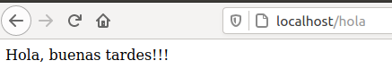

# Docker

Docker empaqueta una aplicación en un contenedor evitando tener que instalar una máquina virtual.
un contenedor es una imagen de Debian básica.

## 1. **Instalación**

1. Instalar Dependencias:
   ~~~
    $ sudo apt install linux-image-generic linux-image-extra-virtual
   ~~~

2. Instalar Docker:
   ~~~
   $ sudo apt install docker docker.io docker-compose
   ~~~

   En caso de error de dependencia containerd: `sudo apt install containerd`

3. Agregarnos al grupo docker para tener permisos:
   ~~~
   $ sudo usermod -aG docker $(whoami)
   ~~~

4. Reiniciamos el ordenador o también podemos cerrar sesión y volver a abrir.

5. Crear contenedor. `docker run` lo creará, indicamos puertos (puertoDeNuestroPC:puertoDelContenedor) y la imagen que vamos a utilizar (httpd). Si agregamos el -d nos lo ejecutará en segundo plano:
   ~~~
   $ docker run -d -p 80:80 --name apache httpd

   $ docker run -p 80:80 -d nginxdemos/hello

   $ docker container stop <nombreContenedor>
   ~~~

## 2. **Comandos**
- Ver contenedores que tenemos funcionando:
  ~~~
  $ docker container ls
  ~~~

- Ver todos los contenedores que tenemos creados:
  ~~~
  $ docker container ls -a
  ~~~
  
- Ejecutar un contenedor que ya existe:
  ~~~
  $ docker start nombre_contenedor

  $ docker container --help
  ~~~

- Ver imágenes. 
   ~~~
   $ doker image ls
   ~~~

- Borrar un contenedor o imagen. Para poder borrar una imagen, hay primero que borrar el contenedor, o forzar el borrado.
  ~~~
  $ docker image rm nombre_imagen o id_imagen

  $ docker container rm nombre_contenedor o id_imagen
  ~~~

- Mostrar logs de un contenedor
   ~~~
   $ docker container logs nombre_contenedor 
   $ docker container logs nombre_contenedor -f
   $ docker container logs nombre_contenedor --tail 10
   $ docker container logs nombre_contenedor --timestamps

   ~~~
- 

- Reiniciar contenedor
   ~~~
   $ docker restart nombre_contenedor
   ~~~

- Como saber que puertos está usando:
  ~~~
  docker inspect httpd
  ~~~
  

- Ejecutar comandos dentro del contenedor. Las `i` y `-t` crean un proceso en el contenedor que nos permitiran interactuar con el contenedor, pueden ponerse también juntas `-it`. 

  ~~~
  $docker exec -i -t nombre_contenedor interprete
  ~~~

  - Ejemplo de uso:
    ~~~
    $ docker exec -it apache /bin/bash
    ~~~

  Ahora pasaremos a trabajar con la terminal dentro del contenedor y por defecto nos lleva al directorio de apache.

  En el archivo `conf/httpd.conf` podremos ver la configuración de apache. Podemos consultarlo con `more httpd.conf`.

  En `htdocs` está el index.html, `apt update` y después `apt install nano` y podremos cambiar contenidos del archivo index.html.

  Para salir del contenedor `exit`. Debemos de tener en cuenta que el contenedor sigue en marcha, en caso de pararlo y arrancarlo, se quedan guardados los cambios que hayamos hecho.

### 3. Crear contenedor webapp, acceder, realizar modificaciones y reiniciar.

  ~~~
  $ docker run -p 8080:5000 --name webapp training/webapp

  $ docker exec -it webapp /bin/bash

  $ apt install nano

  $ nano app.py

  $ exit

  $ docker restart webapp
  ~~~

  Ahora podremos observar los cambios realizados en `app.py`.

### Crear contenedor Apache y Conectar
~~~
$ docker run -p 80:5000 --name miweb training/webapp
$ docker start miweb
$ docker stop miweb
$ docker container rm miweb
~~~

La `p` tiene que ir seguida de los puertos.

Agregando `--rm` se borrará automáticamente al pararlo.

Agregando `-d` se ejecutará en segundo plano.

~~~
$ docker run -p 80:5000 --name miweb --rm -d training/webapp
$ docker stop miweb
~~~

Copiar un contenedor de dentro de docker a nuestro disco, no hace falta indicar los puertos ya que no vamos a acceder via web:

~~~
$ docker run -p --name miweb --rm -d training/webapp
~~~

Copiar:
`docker cp nombrecontenedor:/ruta-del-archivo ruta-destino`
~~~
$ docker cp miweb:/opt/webapp/app.py .
~~~

Editamos el app.py

Creamos el archivo `Dockerfile`, exactamente igual, con la D en mayúscula y dentro del archivo pondremos las instrucciones de lo que queremos hacer.

1. Primero indicar que imagen usamos como base, de cuál partimos. `FROM training/webapp`
2. (Opcional) Indicamos el mantenedor de la imagen `MAINTAINER pacors88@gmail.com`
3. Indicamos nuestro archivo, y la ruta donde va a ir dentro del contenedor. `COPY app.py /opt/webapp/`
4. Resultado del archivo `Dockerfile`:
   ~~~
   FROM training/webapp
   MAINTAINER pacors88@gmail.com
   COPY app.py /opt/webapp/
   ~~~
5. Guardamos y pasaremos a construir una imagen.

6. `docker build -t paco/nuevaweb .`
   - `t` indica el tag de la web
   - `.` le estamos diciendo que el archivo `Dockerfile` se encuentra en el directorio en el que nos situamos en ese momento.

   Si estamos registrados hay que poner nuestro nombre de usuario antes del nombre de la imagen `nombre_usuario/nombre_imagen`

7. Ahora podemos crear un contenedor de nuestra imagen.
   ~~~
   $ docker run -p 80:5000 --name newweb --rm paco/nuevaweb
   ~~~

## EJ2
1. Crear imagen httpd
    ~~~
    $ docker run --rm -p 8080:80 httpd
    ~~~
    Accedemos:
    

2. Crear `Dockerfile`
   ~~~
   $ nano Dockerfile

   FROM httpd
   MAINTAINER soyl3y3nd4@hotmail.com
   COPY web/ /usr/local/apache2/htdocs
   ~~~

3. Construir imagen:
   ~~~
   $ docker build -t soyl3y3nd4/miweb:latest .
   ~~~

4. Subir a dockerhub
   ~~~
   $ docker push soyl3y3nd4/apache
   ~~~

5. Borrar contenedores e imagenes locales.
   ~~~
    $ docker image rm imagen -f
    $ docker container rm contenedor -f
   ~~~
6. Montar container con nuestro `dockerhub`
   ~~~
    $ docker run -p 80:80 --rm --name miweb soyl3y3nd4/apache
   ~~~
  

### Clase 18-12-20 Construir imagen con una web.

~~~
nano Dockerfile

ejemplo* FROM centos:centos6

FROM centos:8      
MAINTAINER soyl3y3nd4@hotmail.com
RUN yum -y install httpd
COPY ejemplo_docker /var/www/html/
CMD ["/usr/sbin/httpd", "-D", "FOREGROUND"]
EXPOSE 80

~~~

Para ejecutar un comando se utiliza `RUN`
COPY para copiar los archivos donde queremos
CMD le dice que ejecute un programa, con la `-D` le decimos, y con FOREGROUND que la ejecute en segundo plano
`EXPOSE` 80 dice que exponga el puerto 80. Si elegimos otro puerto, habrá que especicarlo en apache.

#### CMD, RUN y ENTRYPOINT son para ejecutar comandos.

`RUN` generalmente se usa para instalar cosas: programas, dependencias. Este comando crea una capa.

`CMD` se usa para decir que se ejecute un comando por defecto si no especificamos otro, Si especificamos otro se ejecutará el último.

`ENTRYPOINT` establece un comando que se ejecutará siempre.

#### Shell form
ENV name John Dow
RUN echo "Hello, $name"

####  Exec form
ENV name John Dow
RUN ["/bin/echo", "Hello, $name"]

##### Crear imagen y ejecutar un contenedor
~~~
$ docker build -t miweb .

$ docker run --rm -p 80:80 --name web miweb

~~~

Si modificamos un archivo y volvemos a crear la imagen con el mismo nombre, la volverá a crear, pero cuando comience los comandos que le hemos dicho en el Dockerfile, los que sean idénticos a la capa de la imagen anterior, se copiarán directamente de la caché, sin tener que volvera a crear desde 0.

### Clase 18-12-20 NETWORK.

Cuando creamos un contenedor se crea en una red interna mediante el driver `bridge` en caso de no especificar nada.

Vemos nuestra web y vemos `Gateway` e `IPAddress`.
~~~
$ docker inspect web
~~~

Observamos `Subnet` y `Gateway`:
~~~
$ docker inspect bridge
~~~

En caso de querer crear una red personalizada:

~~~
$ docker network create -d bridge mired
~~~

Ver que contenedores tenemos:
~~~
$ docker network ls
~~~

Al crear un contenedor podemos especificarlo:
~~~
$ docker run -p 80:80 --network=mired -d --name web miweb
~~~

Ahora si inspeccionamos el contenedor, veremos que la red es `mired`:
~~~
$ docker inspect web

            "Networks": {
                "mired": {
                    "IPAMConfig": null,
                    "Links": null,
                    "Aliases": [
                        "734f7c00da14"
                    ],
                    "NetworkID": "65ede233a26545c21105f8c38042a42c92452b5c71d8d50cb877c5c83431c859",
                    "EndpointID": "93050288efddf7da62ddbf29579526a48a26d4ac5235797432f16b6b989d2413",
                    "Gateway": "172.19.0.1",
                    "IPAddress": "172.19.0.2",
                    "IPPrefixLen": 16,
                    "IPv6Gateway": "",
                    "GlobalIPv6Address": "",
                    "GlobalIPv6PrefixLen": 0,
                    "MacAddress": "02:42:ac:13:00:02",
                    "DriverOpts": null
                }
            }

~~~

También podemos hacer que un contenedor se comparta en varias redes.
~~~
$ docker network connect mired web2 
$ docker inspect web2

            "Networks": {
                "mired": {
                    "IPAMConfig": {},
                    "Links": null,
                    "Aliases": [
                        "fee251eb25f2"
                    ],
                    "NetworkID": "65ede233a26545c21105f8c38042a42c92452b5c71d8d50cb877c5c83431c859",
                    "EndpointID": "88ebe8c1b215b8ea60b419d845d993d0403a9ab8d53cca609a10db07fcc57c11",
                    "Gateway": "172.19.0.1",
                    "IPAddress": "172.19.0.3",
                    "IPPrefixLen": 16,
                    "IPv6Gateway": "",
                    "GlobalIPv6Address": "",
                    "GlobalIPv6PrefixLen": 0,
                    "MacAddress": "02:42:ac:13:00:03",
                    "DriverOpts": {}
                },
                "mired2": {
                    "IPAMConfig": null,
                    "Links": null,
                    "Aliases": [
                        "fee251eb25f2"
                    ],
                    "NetworkID": "e0942386aad88cf4d1b0357da5051a36bdfe5f0bde00f8bef92a7545dd352b5f",
                    "EndpointID": "1bcd3058046d64211a86bc92d55d3a08d6e24f21c6179d13750f8a9232b51e15",
                    "Gateway": "172.20.0.1",
                    "IPAddress": "172.20.0.2",
                    "IPPrefixLen": 16,
                    "IPv6Gateway": "",
                    "GlobalIPv6Address": "",
                    "GlobalIPv6PrefixLen": 0,
                    "MacAddress": "02:42:ac:14:00:02",
                    "DriverOpts": null
                }
            }

~~~

Ahora entre ellos dos, ya se pueden comunicar.

## **Vólumenes**
Existen 2 tipos de volúmenes.
- Para crear un volumen usamos:
  ~~~
   $ docker volume create nombre_volumen
  ~~~
- Inspeccionamos:
  ~~~
   $ docker inspect prueba
  ~~~
  

El mountpoint es la ruta en la que se guardaran los contenedores que asociemos a este volumen.

### Forma 1
Estamos diciendole que use el volumen `mivolumen` para que escuche el directorio `:/var/log/apache2`. 
Si no le indicamos nombre de volumen, lo creará igualmente pero con un ID que docker decide.
Si le indicamos el nombre de un volumen y no existe, lo creará igualmente.
~~~
docker run -p 80:80 -v mivolumen:/var/log/apache2 soyl3y3nd4/ejercicio4
~~~

### Forma 2
Le estamos diciendo que en el directorio `~/Documentos/ejercicio-4-DAW/log` genere un volumen que escuche el directorio `/var/log/apache2`
~~~
docker run -p 80:80 -v ~/Documentos/ejercicio-4-DAW/logs:/var/log/apache2 soyl3y3nd4/ejercicio4
~~~