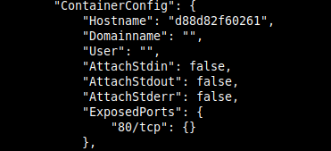
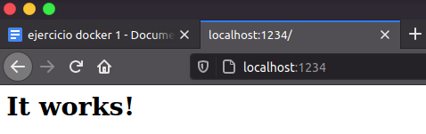
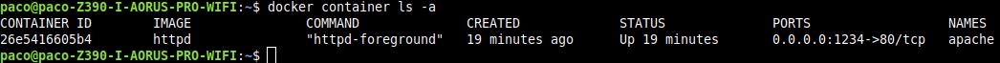
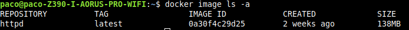
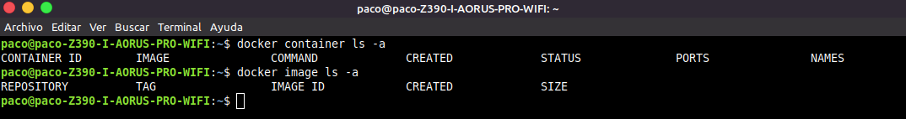

- [Ejercicio 1](#ejercicio-1)
  - [1. (Opcional) **Instalación docker y dependencias.**](#1-opcional-instalación-docker-y-dependencias)
  - [2. **Creación contenedor Apache**](#2-creación-contenedor-apache)
  - [3. **Eliminar contenedor de Apache y la imagen httpd.**](#3-eliminar-contenedor-de-apache-y-la-imagen-httpd)
# Ejercicio 1

## 1. (Opcional) **Instalación docker y dependencias.**

1. Abrimos una terminal e instalamos dependencias de docker y seguidamente docker:
   
   ~~~
   $ sudo apt install linux-image-generic linux-image-extra-virtual

   $ sudo apt install docker docker.io docker-compose
   ~~~

2. Debemos agregarnos al grupo docker para tener permisos:
   
   ~~~
   $ sudo usermod -aG docker $(whoami)
   ~~~

3. Reiniciamos el ordenador o cerramos sesión para que se haga efectivo el acceso al grupo.

4. Si escribrimos `groups` nos deberá de aparecer docker entre los grupos listados.
   
   ~~~
   $ groups
   paco adm cdrom sudo dip plugdev lpadmin sambashare docker
   ~~~
_ _ _ 

## 2. **Creación contenedor Apache**

1. Procedemos a crear un contenedor de Docker de Apache para mostrarlo en el puerto 1234, debemos indicarle este mismo y el puerto de origen del contenedor que vamos a duplicar, en nuestro caso ya sabemos que es el puerto 80, pero en caso de no saberlo, deberíamos de realizar un `docker inspect httpd` y buscar el puerto que utiliza en **"ExposedPorts"**.

   

    Además debemos hacerlo en segundo plano agregando para ello el paramétro `-d` a nuestra instrucción. Hemos agregado también el parametro `--name nombre_que_queramos` para identificar mejor el contenedor posteriormente. Para ello escribiremos por consola la siguiente instrucción:
 
   ~~~
   $ docker run -d -p 1234:80 --name apache httpd

   Unable to find image 'httpd:latest' locally
   latest: Pulling from library/httpd
   852e50cd189d: Pull complete 
   67d51c33d390: Pull complete 
   b0ad2a3b9567: Pull complete 
   136f1f71f30c: Pull complete 
   01f8ace29294: Pull complete 
   Digest: sha256:fddc534b7f6bb6197855be559244adb11907d569aae1283db8e6ce8bb8f6f456
   Status: Downloaded newer image for httpd:latest
   26e5416605b4263e7b26ddec44d5231629627ae8014f4b7510619b3c939d153e
   ~~~

   Como habremos observado, ha intentando buscar la imagen localmente pero al no encontrarla ha procedido a descargar la última versión de httpd (Apache).

2. Accedemos a nuestro navegador y nos dirigimos a **localhost:1234**, si todo está correcto nos encontraremos con un encabezado con las palabras **It works!**.
   
   

3. Ahora podemos consultar el log de nuestro contenedor y ver las peticiones y respuestas del mismo:
   ~~~
   $ docker logs apache

   AH00558: httpd: Could not reliably determine the server's fully qualified domain name, using 172.17.0.2. Set the 'ServerName' directive globally to suppress this message
   AH00558: httpd: Could not reliably determine the server's fully qualified domain name, using 172.17.0.2. Set the 'ServerName' directive globally to suppress this message
   [Mon Dec 07 18:34:56.949102 2020] [mpm_event:notice] [pid 1:tid 140193254204544] AH00489: Apache/2.4.46 (Unix) configured -- resuming normal operations
   [Mon Dec 07 18:34:56.949201 2020] [core:notice] [pid 1:tid 140193254204544] AH00094: Command line: 'httpd -D FOREGROUND'
   172.17.0.1 - - [07/Dec/2020:18:36:38 +0000] "GET / HTTP/1.1" 200 45
   172.17.0.1 - - [07/Dec/2020:18:36:38 +0000] "GET /favicon.ico HTTP/1.1" 404 196
   172.17.0.1 - - [07/Dec/2020:18:39:56 +0000] "GET / HTTP/1.1" 304 -

   ~~~

_ _ _ 

## 3. **Eliminar contenedor de Apache y la imagen httpd.**

Antes de comenzar debemos de tener en cuenta que antes de borrar una imagen, debemos borrar los contenedores que hagan uso de esa imagen, o por el contrario obtendremos errores o simplemente no nos permite hacerlo "por las buenas".

1. Consultamos todos los contenedores que tenemos, tanto los que están en fucnionamiento como los que no:
   ~~~
   $ docker container ls -a
   ~~~
   
   

2.  Ahora para hacer referencia al mismo, o bien podemos hacerlo por su **CONTAINER ID** o bien por el nombre que le hemos asignado previamente y que nos aparece en **NAMES**. Antes de eliminarlo debemos pararlo o por el contrario recibiremos el erro `You cannot remove a running container...`.
   
    Después de pararlo podremos ver que la terminal nos responde con el nombre del container:
    ~~~
    $ docker stop apache 
    apache
    ~~~
3. Ahora ya podemos proceder a eliminar el contenedor y su imagen. Una vez eliminado el container, ya podremos eliminar la imagen, a no ser que tengamos algún contenedor extra creado previamente, aunque no es mi caso.
   ~~~
   $ docker container rm apache
   apache
   ~~~

4. Ahora que ya hemos borrado el container, tenemos vía libre para borrar la imagen. Listamos todas las imágenes que poseemos, y procedemos a borrar la que nos interesa (httpd).
   
   ~~~
   $ docker image ls -a
   ~~~
   

5. Procedemos a borrar la imagen
   ~~~
   $ docker image rm httpd

   Untagged: httpd:latest
   Untagged: httpd@sha256:fddc534b7f6bb6197855be559244adb11907d569aae1283db8e6ce8bb8f6f456
   Deleted: sha256:0a30f4c29d25b3795be1bf2dfc3cb6f84124b3fae4d6dad371542cb04cbdfbb7
   Deleted: sha256:3e7814e179b7aaac7b0c112843c76105920bb78e987fdbb983eee77d1584e38e
   Deleted: sha256:420e5e12cb7aa72644589e66af991793c5dd520612c953b22a4258e3babed1ec
   Deleted: sha256:c403aa451a37dbfc0a08b905bcf062584eb61d072641c75295655b045a4baddf
   Deleted: sha256:24a88c44aaa753f898940405256650c12f18bd6e3e1c24802967f0ac816fbce9
   Deleted: sha256:f5600c6330da7bb112776ba067a32a9c20842d6ecc8ee3289f1a713b644092f8
   ~~~

6. Ahora comprobamos los contenedores e imágenes y deberíamos de obtener el resultado de la imagen:
   ~~~
   $ docker container ls -a
   $ docker image ls -a
   ~~~
   