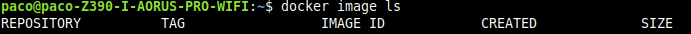
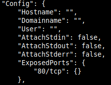
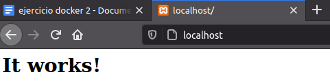
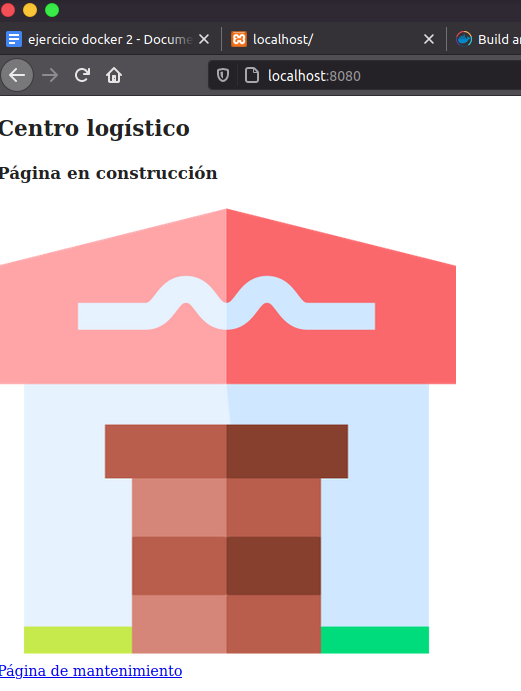
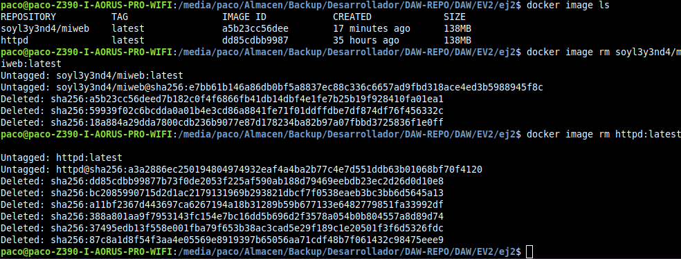

- [Ejercicio 2](#ejercicio-2)
  - [1. (Opcional) **Instalación docker y dependencias.**](#1-opcional-instalación-docker-y-dependencias)
  - [2. **Crear contenedor httpd**](#2-crear-contenedor-httpd)
  - [3. **Creación imagen httpd personalizada**](#3-creación-imagen-httpd-personalizada)
  - [4. **Comprobar funcionamiento imagen local**](#4-comprobar-funcionamiento-imagen-local)
  - [5. **Subir imagen docker local a docker-hub**](#5-subir-imagen-docker-local-a-docker-hub)
  - [6. Borrar imágenes y contenedores locales](#6-borrar-imágenes-y-contenedores-locales)
  - [7. **Crear contenedor con nuestra imagen personalizada desde repositorio**](#7-crear-contenedor-con-nuestra-imagen-personalizada-desde-repositorio)

# Ejercicio 2

## 1. (Opcional) **Instalación docker y dependencias.**

1. Abrimos una terminal e instalamos dependencias de docker y seguidamente docker:
   
   ~~~
   $ sudo apt install linux-image-generic linux-image-extra-virtual

   $ sudo apt install docker docker.io docker-compose
   ~~~

2. Debemos agregarnos al grupo docker para tener permisos:
   
   ~~~
   $ sudo usermod -aG docker $(whoami)
   ~~~

3. Reiniciamos el ordenador o cerramos sesión para que se haga efectivo el acceso al grupo.

4. Si escribrimos `groups` nos deberá de aparecer docker entre los grupos listados.
   
   ~~~
   $ groups
   paco adm cdrom sudo dip plugdev lpadmin sambashare docker
   ~~~
_ _ _ 

## 2. **Crear contenedor httpd**

1. Abrimos una terminal y como desconocemos en que puerto está configurada la imagen, debemos descargarla primero e inspeccionarla, pero antes comprobaremos que no está instalada:
   
2. Como no tenemos ninguna imagen, la descargamos:
   ~~~
   $ docker image pull httpd
   ~~~
3. Ahora debemos inspeccionarla y comprobar en que puerto está configurada por defecto, adicionalmente podemos agregar después del nombre de la imagen, la versión de la misma, en mi caso sólo hay una y la identifica como `latest`.
   
   Debemos de buscar en el archivo un parámetro llamado `ExposedPorts` en el que se indica el número del puerto:
   ~~~
   $ docker image inspect httpd:latest
   ~~~
   
4. Ahora que ya sabemos el puerto por defecto de la imagen, procedemos a crear un contenedor:
   ~~~
   $ docker run --rm -d -p 80:80 --name test httpd
   ~~~

   - Escribimos `docker run` para crear un contenedor y ejecutarlo.
   - El parámetro `--rm` indica que el contenedor será borrado automáticamente al parar el contenedor. 
   - El parámetro `-d` le indica que se ejecutará en segundo plano.
   - El parámetro `-p` debe ir seguido de los puertos, **puerto_deseado:puerto_imagen**.
   - El parámetro `--name` debe ir seguido de un nombre a nuestra elección para identificar más fácilmente el container.
   - Por último el nombre de la imagen, en este caso `httpd`.
5. Ahora si nos dirigimos a la dirección **localhost:puerto_deseado** debería de aparecernos el index.html que hay configurado por defecto.
   
   

_ _ _

## 3. **Creación imagen httpd personalizada**

1. Descargamos el `.zip` adjunto al ejercicio, o bien una web de nuestra elección y ejecutamos una terminal y nos situamos en el directorio previo a la web y crearemos un archivo `Dockerfile` que será donde diremos que imagen base queremos y que archivos va a contener. 

   ~~~
   $ nano Dockerfile
   ~~~
   Debe escribirse con la D en mayúscula o de lo contrario no funcionará correctamente.

2. Ahora indicamos la imagen base de la que vamos a partir, `FROM httpd`, después el mantenedor de la imagen `MAINTAINER nuestro_user@mail.com` y por último indicaremos los archivos que queremos usar y su destino `COPY web/ /usr/local/apache2/htdocs`. 

   El resultado del archivo Dockerfile sería el siguiente:
   ~~~
   FROM httpd
   MAINTAINER nuestro_user@mail.com
   COPY web/ /usr/local/apache2/htdocs
   ~~~
   En el `COPY` hemos indicado primero la carpeta de nuestra página web que queremos insertar en el contenedor y después el directorio destino del contenedor porque ya la conozco de antemano. En el caso de no conocer el directorio destino, habría que buscar dónde se encuentra el index.html de la imagen, para situar nuestra web ahí.
   
3. Ahora que ya tenemos finlaizado nuestro archivo `Dockerfile`, ya podemos crear la imagen con la siguiente instrucción:
   ~~~
   $ docker build -t soyl3y3nd4/miweb:latest .
   Sending build context to Docker daemon  442.4kB
   Step 1/3 : FROM httpd
    ---> dd85cdbb9987
   Step 2/3 : MAINTAINER soyl3y3nd4@hotmail.com
    ---> Running in 1c263ebca5f9
   Removing intermediate container 1c263ebca5f9
    ---> a7acb3111c6a
   Step 3/3 : COPY web/ /usr/local/apache2/htdocs
    ---> 02754294ce0a
   Successfully built 02754294ce0a
   Successfully tagged soyl3y3nd4/miweb:latest
   ~~~

   Después del parámetro `-t` debe de ir nuestro **nombre de usuario de dockerhub** (importante si queremos subir la imagen), **nombre de la imagen** y la **versión**, que en caso de no indicarla la establece por defecto como latest. Por último debemos indicar la ruta del archivo `Dockerfile`, en este caso nos encontramos situados en el mismo directorio con lo que lo indicamos con un **punto**.
_ _ _ 

## 4. **Comprobar funcionamiento imagen local**

1. Ahora que hemos terminado de crear nuestra imagen personalizada, comprobaremos si funciona debidamente y lo haremos de la forma siguiente:
   - Crearemos un contenedor que se borre automáticamente al pararlo
   - Lo haremos en segundo plano
   - Debe ejecutarse en el puerto 8080.

   ~~~
   $ docker run --rm -d -p 8080:80 --name testweb soyl3y3nd4/miweb
   ~~~

2. Ahora si visitamos `localhost:8080` debería de aparecernos la web que hemos seleccionado.
   

_ _ _ 

## 5. **Subir imagen docker local a docker-hub**

1. Antes de realizar la subida de la imagen de docker debemos de habernos registrado previamente en la web de [dockerhub](https://hub.docker.com/). Después nos logearemos en la terminal con nuestra cuenta de docker-hub con `docker login` y se nos solicitará nuestras credenciales:

   ~~~
   $ $ docker login

   Login with your Docker ID to push and pull images from Docker Hub. If you don't have a Docker ID, head over to https://hub.docker.com to create one.
   Username: soyl3y3nd4
   Password: 
   WARNING! Your password will be stored unencrypted in /home/paco/.docker/config.json.
   Configure a credential helper to remove this warning. See
   https://docs.docker.com/engine/reference/commandline/login/#credentials-store

   Login Succeeded

   ~~~

2. Ahora ya podemos subir la imagen a docker-hub.
   ~~~
   $ docker push soyl3y3nd4/miweb

   The push refers to repository [docker.io/soyl3y3nd4/miweb]
   f7e5b51872bf: Pushed 
   bf4cb6a71436: Mounted from library/httpd 
   5792ac1517fc: Mounted from library/httpd 
   53c77568e9ed: Mounted from library/httpd 
   d6e97adfe450: Mounted from library/httpd 
   87c8a1d8f54f: Mounted from library/httpd 
   latest: digest: sha256:e7bb61b146a86db0bf5a8837ec88c336c6657ad9fbd318ace4ed3b5988945f8c size: 1576

   ~~~

## 6. Borrar imágenes y contenedores locales

Ahora borraremos todas nuestros contenedores y nuestras imágenes. Importante respetar ese order, primero borrar contenedores (además deben de estar parados) y después las imágenes o de lo contrario recibiremos un error de que no se ha podido realizar la operación.

- Para ver los contenedores que tenemos activos:
    ~~~
    $ docker container ls
    ~~~

- Para ver los contenedores que tenemos creados pero inactivos:
    ~~~
    $ docker container ls -al
    ~~~

- Para ver las imágenes que tenemos descargadas:
    ~~~
    $ docker image ls
    ~~~

- Parar contenedores activos:
    ~~~
    $ docker stop <nombre_contenedor>
    ~~~
- Los comandos para borrar contenedores e imágenes son los siguientes:

    ~~~
    $ docker container rm <nombre_contenedor>

    $ docker image rm <nombre_imagen>
    ~~~

_ _ _

## 7. **Crear contenedor con nuestra imagen personalizada desde repositorio**

En los pasos anteriores hemos creado una imagen personalizada local y la hemos utilizado para crear un container pero localmente. Después la hemos subido al repositorio de docker-hub para que cualquiera tenga acceso a ella. Ahora si todo ha ido bien y la volvemos a instalar, docker buscará esa imagen localmente y en caso de no encontrarla buscara la en el repositorio remoto y procederá a su instalación.

~~~
$ docker run --rm -d -p 8080:80 --name 
pruebawebfinal soyl3y3nd4/miweb

Unable to find image 'soyl3y3nd4/miweb:latest' locally
latest: Pulling from soyl3y3nd4/miweb
6ec7b7d162b2: Pull complete 
17e233bac21e: Pull complete 
130aad5bf43a: Pull complete 
81d0a34533d4: Pull complete 
da240d12a8a4: Pull complete 
0b0077ebc30f: Pull complete 
Digest: sha256:e7bb61b146a86db0bf5a8837ec88c336c6657ad9fbd318ace4ed3b5988945f8c
Status: Downloaded newer image for soyl3y3nd4/miweb:latest
4b5ed3386a539af6ff8b12662f48f3d6122402a13a91cb0141c18200dd5d019e

~~~
      