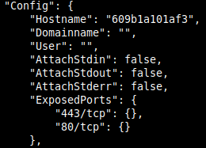
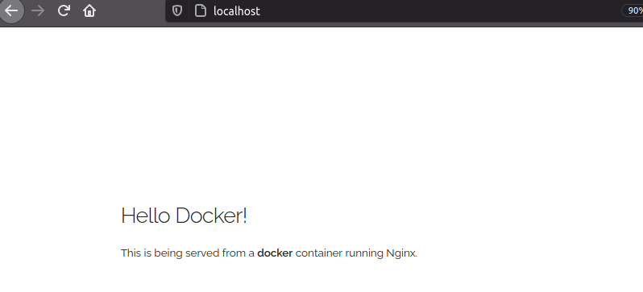
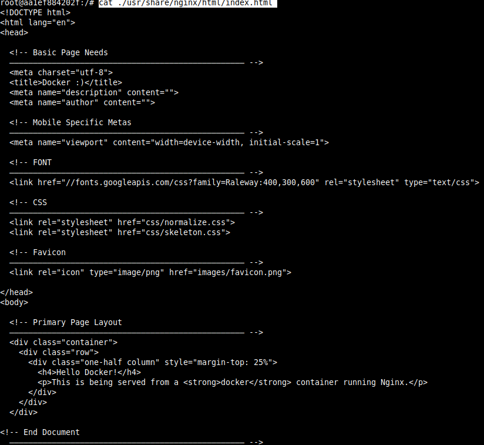
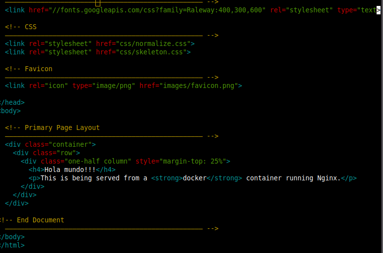
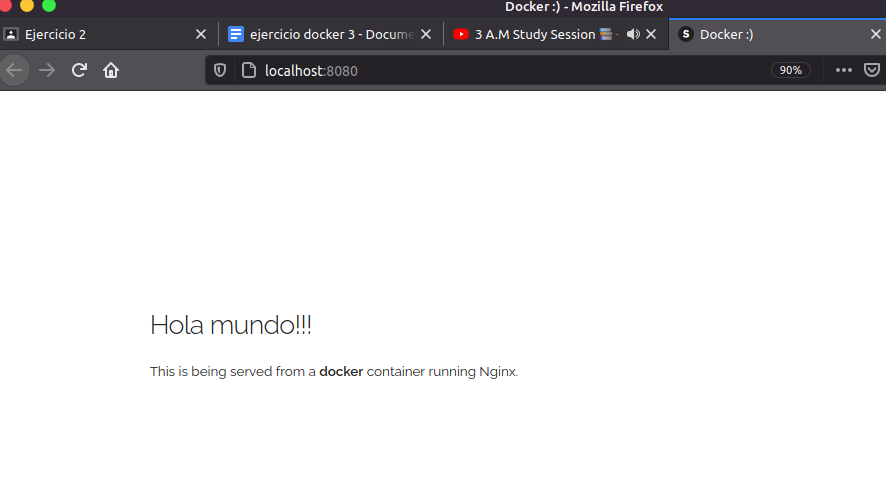
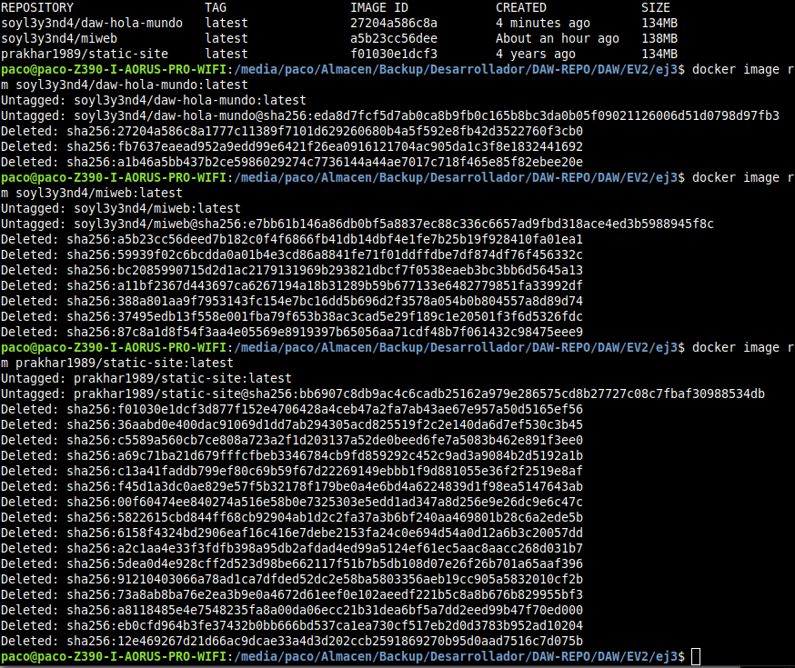

- [Ejercicio 3](#ejercicio-3)
  - [1. (Opcional) **Instalación docker y dependencias.**](#1-opcional-instalación-docker-y-dependencias)
  - [2. **Crear contenedor con una imagen remota**](#2-crear-contenedor-con-una-imagen-remota)
  - [3. **Conexión interactiva con contenedor**](#3-conexión-interactiva-con-contenedor)
  - [4. **Creación imagen httpd personalizada**](#4-creación-imagen-httpd-personalizada)
  - [4. **Comprobar funcionamiento imagen local**](#4-comprobar-funcionamiento-imagen-local)
  - [5. **Subir imagen docker local a docker-hub**](#5-subir-imagen-docker-local-a-docker-hub)
  - [6. Borrar imágenes y contenedores locales](#6-borrar-imágenes-y-contenedores-locales)
  - [7. **Crear contenedor con nuestra imagen personalizada desde repositorio**](#7-crear-contenedor-con-nuestra-imagen-personalizada-desde-repositorio)

# Ejercicio 3

## 1. (Opcional) **Instalación docker y dependencias.**

1. Abrimos una terminal e instalamos dependencias de docker y seguidamente docker:
   
   ~~~
   $ sudo apt install linux-image-generic linux-image-extra-virtual

   $ sudo apt install docker docker.io docker-compose
   ~~~

2. Debemos agregarnos al grupo docker para tener permisos:
   
   ~~~
   $ sudo usermod -aG docker $(whoami)
   ~~~

3. Reiniciamos el ordenador o cerramos sesión para que se haga efectivo el acceso al grupo.

4. Si escribrimos `groups` nos deberá de aparecer docker entre los grupos listados.
   
   ~~~
   $ groups
   paco adm cdrom sudo dip plugdev lpadmin sambashare docker
   ~~~
_ _ _ 

## 2. **Crear contenedor con una imagen remota**

1. Abrimos una terminal y como desconocemos en que puerto está configurada la imagen, debemos descargarla primero.
   ~~~
   $ docker image pull prakhar1989/static-site
   ~~~
2. Ahora debemos inspeccionarla y comprobar en que puerto está configurada por defecto, adicionalmente podemos agregar después del nombre de la imagen, la versión de la misma, en mi caso sólo hay una y la identifica como `latest`.
   
   Debemos de buscar en el archivo un parámetro llamado `ExposedPorts` en el que se indica el número del puerto:
   ~~~
   $ docker image inspect prakhar1989/static-site
   ~~~
   

3. Ahora que ya sabemos el puerto por defecto de la imagen, procedemos a crear un contenedor. En mi caso he elegido el 80 porque el 443 que indica en ExposedPorts no me ha funcionado:
   ~~~
   $ docker run --rm -d -p 80:80 --name prueba prakhar1989/static-site
   ~~~

   - Escribimos `docker run` para crear un contenedor y ejecutarlo.
   - El parámetro `--rm` indica que el contenedor será borrado automáticamente al parar el contenedor. 
   - El parámetro `-d` le indica que se ejecutará en segundo plano.
   - El parámetro `-p` debe ir seguido de los puertos, **puerto_deseado:puerto_imagen**.
   - El parámetro `--name` debe ir seguido de un nombre a nuestra elección para identificar más fácilmente el container.
   - Por último el nombre de la imagen, en este caso `httpd`.

4. Ahora si nos dirigimos a la dirección **localhost:puerto_deseado** debería de aparecernos el index.html que hay configurado por defecto.
   
   

Si comprobamos los logs vemos que ha recibido conexiones:
~~~
$ docker container logs prueba 

Nginx is running...
172.17.0.1 - - [13/Dec/2020:00:23:41 +0000] "GET / HTTP/1.1" 200 2041 "-" "Mozilla/5.0 (X11; Ubuntu; Linux x86_64; rv:83.0) Gecko/20100101 Firefox/83.0" "-"
172.17.0.1 - - [13/Dec/2020:00:23:41 +0000] "GET /css/skeleton.css HTTP/1.1" 200 11452 "http://localhost/" "Mozilla/5.0 (X11; Ubuntu; Linux x86_64; rv:83.0) Gecko/20100101 Firefox/83.0" "-"
172.17.0.1 - - [13/Dec/2020:00:23:41 +0000] "GET /images/favicon.png HTTP/1.1" 200 1156 "http://localhost/" "Mozilla/5.0 (X11; Ubuntu; Linux x86_64; rv:83.0) Gecko/20100101 Firefox/83.0" "-"

~~~
_ _ _

## 3. **Conexión interactiva con contenedor**

Nuestro siguiente paso es buscar el directorio específico en el que se situa el index.html en el que aparece el mensaje que hemos visto en la captura anterior.

Para conectar con el container deberemos de realizar lo siguiente:

1. Debemos de tener un contenedor en ejecución.
2. Introducir la siguiente instrucción:
   ~~~
   $ docker exec -it prueba /bin/bash
   ~~~

   Con `-it` le decimos que es una conexión interactiva y con el parámetro `/bin/bash` le estamos diciendo el intérprete que vamos a usar.

3. Buscamos el archivo `index.html`:
   ~~~
   $ find -iname index.html

   ./usr/share/doc/adduser/examples/adduser.local.conf.examples/skel.other/index.html

   ./usr/share/nginx/html/index.html
   ~~~
3. Obviamente el archivo que buscamos es el que pertenece a la segunda ruta, pero comprobamos su contenido por lo que pueda pasar.
   ~~~
   $ cat ./usr/share/nginx/html/index.html 
   ~~~ 
   

   Ya sabemos la ruta del `index.html` por lo que ya podremos proceder a editar nuestra propia imagen.
4. Aprovechamos y copiamos el `index.html` del contenedor, fuera de él para editarlo posteriormente:
   ~~~
   $ docker cp prueba:/usr/share/nginx/html/index.html .
   ~~~
5. Salimos.
   ~~~
   $ exit
   ~~~
   Indicamos el nombre del contenedor seguido de dos puntos, después la ruta o archivo que queremos copiar y como segundo parámetro la ruta destino, en mi caso en el mismo.

6. Editamos el index.html

_ _ _

## 4. **Creación imagen httpd personalizada**

1. Crearemos un archivo `Dockerfile` que será donde diremos que imagen base queremos y que archivos va a contener. 

   ~~~
   $ nano Dockerfile
   ~~~
   Debe escribirse con la D en mayúscula o de lo contrario no funcionará correctamente.

2. Ahora indicamos la imagen base de la que vamos a partir, `FROM prakhar1989/static-site`, después el mantenedor de la imagen `MAINTAINER nuestro_user@mail.com` y por último indicaremos los archivos que queremos usar y su destino `COPY index.html /usr/share/nginx/html`. 

   El resultado del archivo Dockerfile sería el siguiente:
   ~~~
   FROM prakhar1989/static-site
   MAINTAINER nuestro_user@mail.com
   COPY index.html /usr/share/nginx/html
   ~~~

   En el `COPY` hemos indicado primero el archivo que queremos insertar (index.html) en el contenedor y después el directorio destino que hemos buscado en los pasos previos.
   
3. Ahora que ya tenemos finlaizado nuestro archivo `Dockerfile`, ya podemos crear la imagen con la siguiente instrucción:
   ~~~
   $ docker build -t soyl3y3nd4/daw-hola-mundo:latest .

   Sending build context to Docker daemon    108kB
   Step 1/3 : FROM prakhar1989/static-site
   ---> f01030e1dcf3
   Step 2/3 : MAINTAINER nuestro_user@mail.com
   ---> Running in 28d9510dff78
   Removing intermediate container 28d9510dff78
   ---> 784969ffc187
   Step 3/3 : COPY index.html /usr/share/nginx/html
   ---> 8fe123f35adb
   Successfully built 8fe123f35adb
   Successfully tagged soyl3y3nd4/daw-hola-mundo:latest

   ~~~

   Después del parámetro `-t` debe de ir nuestro **nombre de usuario de dockerhub** (importante si queremos subir la imagen), **nombre de la imagen** y la **versión**, que en caso de no indicarla la establece por defecto como latest. Por último debemos indicar la ruta del archivo `Dockerfile`, en este caso nos encontramos situados en el mismo directorio con lo que lo indicamos con un **punto**.
_ _ _ 

## 4. **Comprobar funcionamiento imagen local**

1. Ahora que hemos terminado de crear nuestra imagen personalizada, comprobaremos si funciona debidamente y lo haremos de la forma siguiente:
   - Crearemos un contenedor que se borre automáticamente al pararlo
   - Lo haremos en segundo plano
   - Debe ejecutarse en el puerto 8080.

   ~~~
   $ docker run --rm -d -p 8080:80 --name hola soyl3y3nd4/daw-hola-mundo
   ~~~

2. Ahora si visitamos `localhost:8080` debería de aparecernos la web que hemos seleccionado.
   

_ _ _ 

## 5. **Subir imagen docker local a docker-hub**

1. Antes de realizar la subida de la imagen de docker debemos de habernos registrado previamente en la web de [dockerhub](https://hub.docker.com/). Después nos logearemos en la terminal con nuestra cuenta de docker-hub con `docker login` y se nos solicitará nuestras credenciales:

   ~~~
   $ $ docker login

   Login with your Docker ID to push and pull images from Docker Hub. If you don't have a Docker ID, head over to https://hub.docker.com to create one.
   Username: soyl3y3nd4
   Password: 
   WARNING! Your password will be stored unencrypted in /home/paco/.docker/config.json.
   Configure a credential helper to remove this warning. See
   https://docs.docker.com/engine/reference/commandline/login/#credentials-store

   Login Succeeded

   ~~~

2. Ahora ya podemos subir la imagen a docker-hub.
   ~~~
   $ docker push soyl3y3nd4/daw-hola-mundo

   The push refers to repository [docker.io/soyl3y3nd4/daw-hola-mundo]
   9fba0d202eb6: Pushed 
   5f70bf18a086: Mounted from prakhar1989/static-site 
   1b02d6d2172f: Mounted from prakhar1989/static-site 
   2e374fd8130c: Mounted from prakhar1989/static-site 
   6292e9fb3e48: Mounted from prakhar1989/static-site 
   b74bb18be134: Mounted from prakhar1989/static-site 
   d558cbaf81a4: Mounted from prakhar1989/static-site 
   ebfc3a74f160: Mounted from prakhar1989/static-site 
   031458dc7254: Mounted from prakhar1989/static-site 
   12e469267d21: Mounted from prakhar1989/static-site 
   latest: digest: sha256:eda8d7fcf5d7ab0ca8b9fb0c165b8bc3da0b05f09021126006d51d0798d97fb3 size: 3633
   ~~~

## 6. Borrar imágenes y contenedores locales

Ahora borraremos todas nuestros contenedores y nuestras imágenes. Importante respetar ese order, primero borrar contenedores (además deben de estar parados) y después las imágenes o de lo contrario recibiremos un error de que no se ha podido realizar la operación.

- Para ver los contenedores que tenemos activos:
    ~~~
    $ docker container ls
    ~~~

- Para ver los contenedores que tenemos creados pero inactivos:
    ~~~
    $ docker container ls -al
    ~~~

- Para ver las imágenes que tenemos descargadas:
    ~~~
    $ docker image ls
    ~~~

- Parar contenedores activos:
    ~~~
    $ docker stop <nombre_contenedor>
    ~~~
- Los comandos para borrar contenedores e imágenes son los siguientes:

    ~~~
    $ docker container rm <nombre_contenedor>

    $ docker image rm <nombre_imagen>
    ~~~

   

_ _ _

## 7. **Crear contenedor con nuestra imagen personalizada desde repositorio**

En los pasos anteriores hemos creado una imagen personalizada local y la hemos utilizado para crear un container pero localmente. Después la hemos subido al repositorio de docker-hub para que cualquiera tenga acceso a ella. Ahora si todo ha ido bien y la volvemos a instalar, docker buscará esa imagen localmente y en caso de no encontrarla buscara la en el repositorio remoto y procederá a su instalación.

~~~
$ docker run --rm -d -p 8080:80 --name holamundo soyl3y3nd4/daw-hola-mundo

Unable to find image 'soyl3y3nd4/daw-hola-mundo:latest' locally
latest: Pulling from soyl3y3nd4/daw-hola-mundo
d4bce7fd68df: Pull complete 
a3ed95caeb02: Pull complete 
573113c4751a: Pull complete 
31917632be33: Pull complete 
77e66f18af1c: Pull complete 
df3f108f3ade: Pull complete 
d7a279eb19f5: Pull complete 
e798589c05c5: Pull complete 
78eeaf458ae0: Pull complete 
6d75bd0f9498: Pull complete 
Digest: sha256:eda8d7fcf5d7ab0ca8b9fb0c165b8bc3da0b05f09021126006d51d0798d97fb3
Status: Downloaded newer image for soyl3y3nd4/daw-hola-mundo:latest
af50295172acdbdde78766bd3d0c5a4ab767db45799854a0205b21fa602a7f53

~~~
      