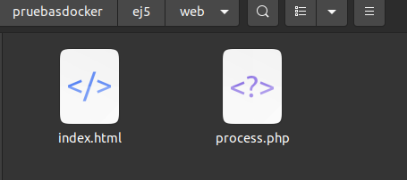
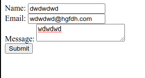
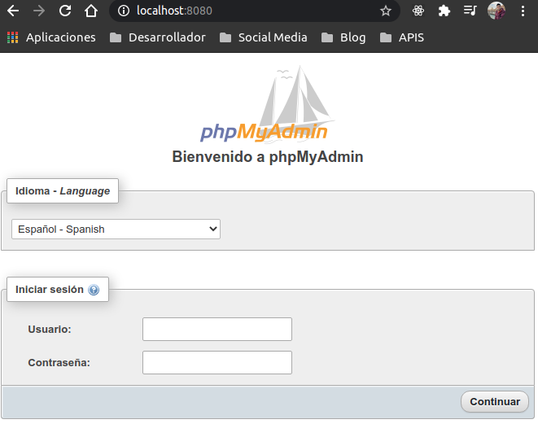
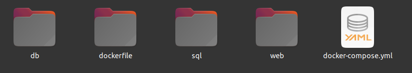

# EJ5

- [EJ5](#ej5)
  - [1 Creación imagen Apache & PHP](#1-creación-imagen-apache--php)
  - [2 Creación servicio PHP](#2-creación-servicio-php)
  - [3 Creación servicio PHPmyadmin](#3-creación-servicio-phpmyadmin)
  - [4 Creacion servicio mariadb](#4-creacion-servicio-mariadb)
  - [5 Creación de redes:](#5-creación-de-redes)
  - [6 Probar funcionamiento](#6-probar-funcionamiento)

## 1 Creación imagen Apache & PHP

1. Como la imagen que necesitamos, debe incluir una extensión, comenzamos crear un archivo `Dockerfile` en el que especificamos la imagen y el comando.
    ~~~
    $ mkdir dockerfile
    $ cd dockerfile
    $ nano Dockerfile

    FROM php:apache
    MAINTAINER soyl3y3nd4@hotmail.com
    RUN docker-php-ext-install mysqli && docker-php-ext-enable mysqli

    ~~~

2. Creamos la imagen con el `Dockerfile` creado.
   ~~~
   $ docker build -t soy3l3y3nd4/apachephp
   ~~~
    El nombre que le hemos especificado a la imagen será el que usaremos en nuestro `docker-compose.yml`.

## 2 Creación servicio PHP

1. Primero creamos un directorio con los archivos anexos (index.html y process.php) llamado **web** y colocamos los archivos dentro.

    

2. Comenzamos a crear nuestro docker-compose.yml. usaremos la imagen creada previamente, le daremos el nombre de apachephp al contenedor y debe estar en l puerto 80. Debemos también de conectarlo a un volumen para enlazarlo a unos archivos locales.
   ~~~
   version: "3"
   services:
     apachephp:
     image: soyl3y3nd4/apachephp
     container_name: apachephp
     ports:
     - 80:80
     volumes:
     - ~/Documentos/pruebasdocker/ej5/web/:/var/www/html
   ~~~

3. Realizamos un `$ docker-compose up` y comprobamos. Debería aparecernos un formulario pero no funcional, ya que falta la base de datos todavía.
   

## 3 Creación servicio PHPmyadmin

1. Ahora agregaremos a nuestro archivo `docker-compose.yml` otro servicio para poder acceder a la base de datos. Debemos de hacerlo en el puerto 8080, con una imagen de phpmyadmin y agregarle una variable de entorno **PMA_HOST** con el valor mariadb.
   ~~~
       version: "3"
   services:
     apachephp:
        image: soyl3y3nd4/apachephp
        container_name: apachephp
        ports:
           - 80:80
        volumes:
           - ~/Documentos/pruebasdocker/ej5/web/:/var/www/html
     phpmyadmin:
        image: phpmyadmin:latest
        ports:
            - 8080:80
        environment:
            PMA_HOST: mariadb
   ~~~
2. Ahora podemos realizar `$ docker-compose up` y accederemos a locaslhost y localhost:8080 para comprobar, si todo ha ido bien tendremos phpmyadmin funcionando, pero sin conexión a BBDD.
   

## 4 Creacion servicio mariadb

1. El servicio se va a llamar **mariadb**.
    ~~~
        mariadb:
            image: mariadb:latest
            volumes:
              - ~/Documentos/pruebasdocker/ej5/db:/var/lib/mysql
            command: --init-file /data/application/init.sql 
    ~~~
2. Debemos de crear un volumen para tener respaldo de las BBDD, el directorio es `/var/lib/mysql` y lo conectaremos a un directorio local llamado `db`, en caso de que el directorio no lo creemos manualmente, lo creará docker si no existe.
    ~~~
    $ mkdir db

    mariadb:
        image: mariadb:latest
        volumes:
        - ~/Documentos/pruebasdocker/ej5/db:/var/lib/mysql
    ~~~
3. Agregaremos también la siguient isntrucción para que la arranque al iniciar: `command: --init-file /data/application/init.sql`. Para que esto funcione hay que indicarle donde va a estar el archivo `init.sql`. Lo haremos mediante un volumen.
    ~~~
     mariadb:
     image: mariadb:latest
     volumes: 
         - ~/Documentos/pruebasdocker/ej5/db:/var/lib/mysql
         - ~/Documentos/pruebasdocker/ej5/sql/init.sql:/data/application/init.sql
     command: --init-file /data/application/init.sql

    ~~~
4. Ahora deberemos de inicializar la variables de entorno `MYSQL_ROOT_USER, MYSQL_ROOT_PASSWORD, MYSQL_DATABASE, MYSQL_USER, MYSQL_PASSWORD`.
    ~~~
    mariadb:
        image: mariadb:latest
        volumes: 
            - ~/Documentos/pruebasdocker/ej5/db:/var/lib/mysql
            - ~/Documentos/pruebasdocker/ej5/sql/init.sql:/data/application/init.sql
        command: --init-file /data/application/init.sql
        environment:
            MYSQL_ROOT_USER: "root"
            MYSQL_ROOT_PASSWORD: "admin"
            MYSQL_DATABASE: "testdb"
            MYSQL_USER: "user"
            MYSQL_ROOT_PASSWORD: "user"
    ~~~
    Debemos de prestar atención a las variables **MYSQL_DATABASE, MYSQL_USER, MYSQL_PASSWORD**, porque esos datos de la conexión deben de ser los mismo que los del archivo process.php

5. Si todo lo hemos realizado correctamente, deberiamos de tener una carpeta estructurada como la siguiente imagen:
   

## 5 Creación de redes:

1. Ahora para que se comuniquen internamento los servicios, debemos de hacerlo mediante redes, para ello crearemos 2 redes: `backend` y `frontend`. Estas redes debemos de crearlas paralelas a donde declaramos **services**.
    ~~~
    networks:
        frontend:
        backend:
    ~~~
2. Una vez creadas estas redes, deberemos de aplicarlas a las servicios respectivos. A mariaDB y phpMyAdmin les aplicaremos la red backend, y a apachephp la red frontend y backend, así se comunicará con ambos módulos. Sólo abrá que agregar a cada servico la palabra `networks:` y en la línea siguiente indicar la red.

    ~~~
    networks:
      - frontend
    ~~~

3. Además agregaremos tanto a apachephp com a phpmyadmin la etiqueta `depends_on:` y el nombre del servicio, en este caso mariadb, para que lo priorice y evitar así errores.
    ~~~
    version: "3"
    services:
        apachephp:
            build: ./dockerfile/
            container_name: pruebaapachephp
            ports:
                - 80:80
            volumes:
                - /home/paco/Documentos/ej5/web:/var/www/html
            depends_on:
                - mariadb
            networks:
                - backend
                - frontend
        phpmyadmin:
            image: phpmyadmin/phpmyadmin:latest
            container_name: pruebaphp
            ports:
                - 8080:80
            environment:
                PMA_HOST: mariadb
            depends_on:
                - mariadb
            networks:
                - backend
        mariadb:
            image: mariadb:latest
            container_name: mdb
            ports:
                - 3306:3306
            volumes:
                - /home/paco/Documentos/pruebasdocker/ej5/db:/var/lib/mysql
                - /home/paco/Documentos/pruebasdocker/ej5/sql/init.sql:/data/application/init.sql
            command: --init-file /data/application/init.sql
            environment:
                MYSQL_ROOT_USER: root
                MYSQL_ROOT_PASSWORD: admin
                MYSQL_DATABASE: testdb
                MYSQL_USER: user
                MYSQL_PASSWORD: user
            networks:
                - backend
    networks:
        frontend:
        backend:
    ~~~

## 6 Probar funcionamiento

1. Ahora una vez terminado el archivo docker-compose, realizamos `docker-compose up` y podremos rellenar el formulario y recibir una respuesta del servidor.
 

2. Si accedemos a `localhost:8080` y hacemos login con **user** deberiamos de poder tener acceso a la BD testdb y podremos observar los datos introducidos.
 
