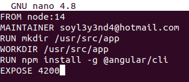
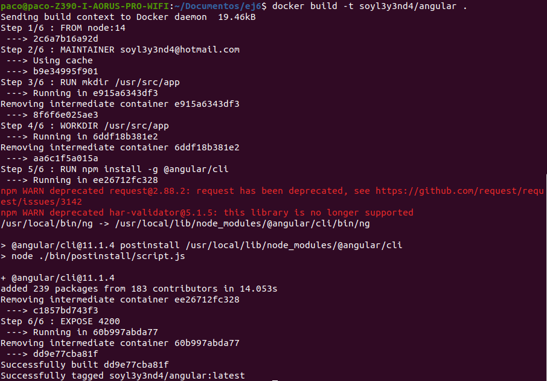
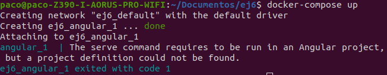
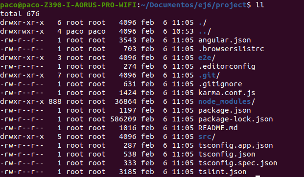
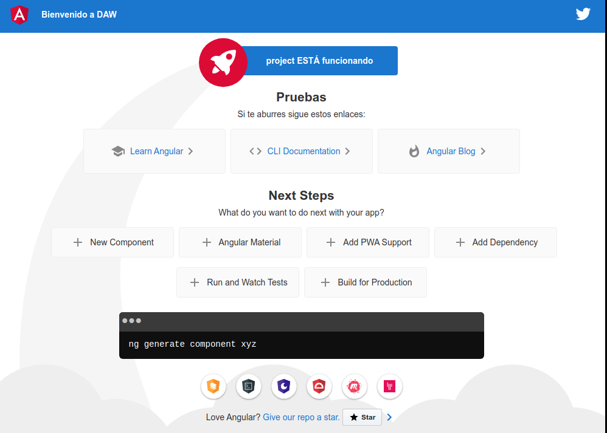
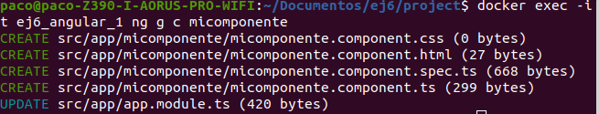

# Ej6

## 1 Creación de imagen con Dockerfile

1. Antes de comenzar debemos de seleccionar la imagen que queremos de dockerhub, en este caso vamos a elegir la versión 14.
   
2. Una vez sepamos la versión que queremos comenzamos generando el archivo `Dockerfile`.
   ~~~
   $ nano Dockerfile
   ~~~

3. Dentro indicaremos la versión de node con el comando `FROM`.
   
4. Si deseamos subir la imagen a Docker-hub deberemos de poner también el `MAINTAINER`.
   ~~~
   FROM node:14
   MAINTAINER correo@correo.es
   ~~~

5. Ahora si queremos hacer que un directorio sea por defecto cuando se ejecuta el contenedor, lo haremos gracias a `WORKDIR`, pero antes de hacerlo es recomendable asegurarse de que existe ese directorio, por lo que si lo creamos vamos a seguro. De cualquier modo he probado a establecer un `WORKDIR` que no existe y docker lo crea automáticamente.
   ~~~
   RUN mkdir /usr/src/app
   WORKDIR /usr/src/app
   ~~~

6. Lo siguiente es decirle que instale Angular.
   ~~~
   RUN npm install -g @angular/cli
   ~~~

7. Finalmente le diremos que exponga el puerto **4200**
   ~~~
   EXPOSE 4200
   ~~~

8. Nuestro archivo `Dockerfile` habrá quedado de la siguiente forma:
   
   

9.  Por último sólo nos queda crear la imagen.
    ~~~
    $ docker build -t nombre_usuario_dockerhub/angular    ruta_al_archivo_dockerfile
    ~~~

    
____

## 2 Creación de archivo docker-compose

1. Procedemos a crear un docker-compose para que haga uso de nuestra imagen de angular recién creada. Le asignaremos también el puerto 80 y haremos que se inicie por defecto.
   ~~~
   version: "3"
   services:
      angular: 
        image: soyl3y3nd4/angular
        ports:
          - 80:4200
        volumes:
          - ./project:/usr/src/app
        command:  ng serve --host 0.0.0.0 --poll=2000
   ~~~

2. Si hacemos `$ docker-compose up` efectivamente podemos comprobar que como no existe ningún proyecto, nos avisa de que no puede encontrarlo.
   
   

3. Ahora lo que tenemos que hacer es crear un proyecto para que nos lo enlace a nuestra carpeta local y podamos trabajar con él.
   
   ~~~
   $ docker run --rm -it soyl3y3nd4/angular ng new project
   ~~~
   Ahora comenzará el proceso de creación del proyecto en Angular. Pero claro, esto crea un proyecto, se cierra el contenedor y se pierde, para ello tenemos que indicarle la carpeta local en la que debe hacer un respaldo del proyecto mediante un volumen.

   ~~~
   $ docker run --rm -it -v ~/Documentos/ej6:/usr/src/app soyl3y3nd4/angular ng new project
   ~~~

4. Ahora si accedemos a nuestra carpeta local, podremos observa que está nuestro proyecto, pero no tenemos permisos para modificarlo, ya que no somos los propietarios del mismo.

   

5. Cambiamos propietario del directorio local del proyecto.
   ~~~
   $ sudo chown nuestro_usuario:grupo project -R
   ~~~
   Modificamos por ejemplo el app.component.html y guardamos.
6. Realizamos `docker-compose up` y deberiamos de poder ver en localhost nuestro proyecto funcionando.
   
   

7. Finalmente si queremos crear un componente sin parar el contenedor, deberemos de hacerlo de forma interactiva, para ello usaremos `docker exec`.
   ~~~
   docker exec -it nombre_contenedor ng g c micomponente
   ~~~

   
   
8. Finalmente nos faltará cambiar el propietario de este nuevo componente de nuevo, ya que al crearse desde el contenedor el propietario por defecto es root.
   ~~~
   $ sudo chown nuestro_usuario:grupo project -R
   ~~~
