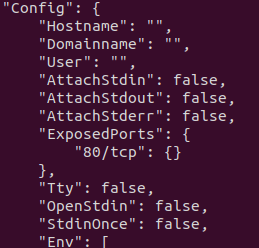
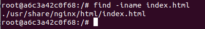
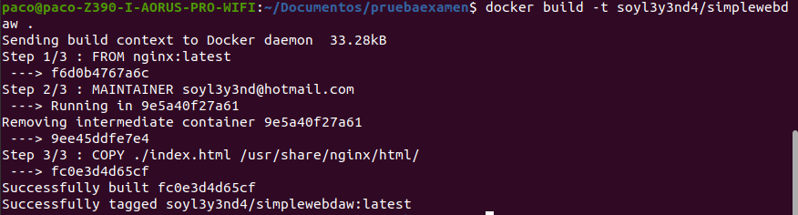
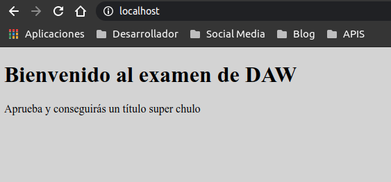
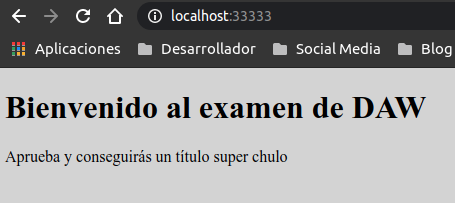
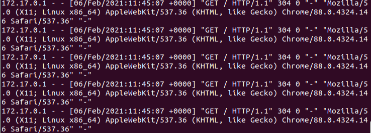

# Parte 1 Examen

- [Parte 1 Examen](#parte-1-examen)
  - [1 Preparación de la información](#1-preparación-de-la-información)
  - [2 Creación archivo Dockerfile](#2-creación-archivo-dockerfile)
  - [3 Probar nuestra imagen](#3-probar-nuestra-imagen)

## 1 Preparación de la información
1. Para comenzar elegimos una imagen de **nginx** de docker-hub. La vamos a descargar, y le haremos un `inspect` para comprobar que puerto usa, y luego crearemos una sesión interactiva de un container para buscar el directorio donde se ubica el index.html o index.php. En mic aso he seleccionado la última versión de **nginx**.
   ~~~
   $ docker pull nginx:latest
   ~~~

2. Ahora ya podemos realizar un inspect de la imagen, buscaremos `Exposed Ports`
   ~~~
   docker inspect nginx:latest
   ~~~

   
   
3. Ya sabemos en que puerto trabaja, ahora debemos de averiguar en que directorio se ubica el `index.html`, pasaremos a crear una sesión interactiva de un container, una vez dentro buscaremos el archivo.
   ~~~
   $ docker run --rm -it nginx:latest /bin/bash
   $ find -iname index.html
   ~~~
   Nos responde con la ubicación del archivo
   
   

4. Ahora que ya tenemos toda la información podemos proceder a crear nuestro archivo `Dockerfile`.
   

___

## 2 Creación archivo Dockerfile

1. Ahora deberos de crear nuestro archivo en el que indicaremos la imagen a usar mediante `FROM`, el mantenedor de la imagen mediante `MAINTAINER`, y los comandos y operaciones que queremos ejecutar, en nuestro caso vamos a copiar un index.html que hemos personalizado previamente, ubicado en el mismo directorio.
   ~~~
   FROM nginx:latest
   MAINTAINER soyl3y3nd@hotmail.com
   COPY ./index.html /usr/share/nginx/html/
   ~~~
   Guardamos el archivo y lo cerramos.

2. Ahora vamos a borrar los contenedores e imágenes que hemos descargado previamente. Los contenedores que creemos con el parámetro `--rm` se borrarán automáticamente, así evitamos estar borrando contínuamente. Es important saber que antes de eliminar un contenedor hay que pararlo, y antes de borrar una imagen, debemos de borrar los contenedores que hacen uso de ella.
   
   - Parar un contenedor `$ docker stop nombre_contenedor`.
   - Con `$ docker container ls` listamos todos los contenedos que están ejecutándose.
   - Con `$ docker container ls -al` listamos todos. 
   - Con `$ docker container rm nombre_contenedor` borramos un contenedor.
   
   Para realizar lo mismo con las imágenes, deberemos de sustituir la palabra **container** por la palabra **image**.

3. Una vez hemos eliminado contenedores e imágenes, por ese orden, vamos a ejecutar nuestro `Dockerfile`
   
   ~~~
   docker build -t nombre_user/nombre
   ~~~

4. Si todo ha ido bien nos responderá lo siguiente:
   
   

5. Probamos la imagen para ver que todo ha ido correctamente.
   ~~~
   $ docker run --rm -p 80:80 soyl3y3nd4/simplewebdaw
   ~~~
6. Visitamos `localhost` y deberíamos de ver nuestro **index.html**.
   
   

7. Para subir nuestra imagen a docker-hub deberemos de hacer login previamente si todavía no tenemos enlazada nuestra cuenta.
   ~~~
   $ docker login
   ~~~
   Se nos solicitará nuestra credenciales  de **docker-hub** y podremos continuar.

8. Ahora solo nos queda subirla a nuestro docker-hub.
   ~~~
   $ docker push nombre_image/nombre
   ~~~

9.  Eliminamos los contenedores e imágenes locales. Si no tenemos nada importante en docker, podemos escribir estos dos comandos y **borraremos todos los contenedores e imágenes**.
    ~~~
    $ docker container prune
    $ docker image prune --all
    ~~~

___

## 3 Probar nuestra imagen

1. Ahora vamos a comprobar a crear un contenedor con nuestra nueva imagen.
    ~~~
    $ docker run --rm -d -p 33333:80 nombre_contenedor/nombre
    ~~~

   

    Y si observamos los logs con `$ docker logs nombre_contenedor` veremos las peticiones.

   
