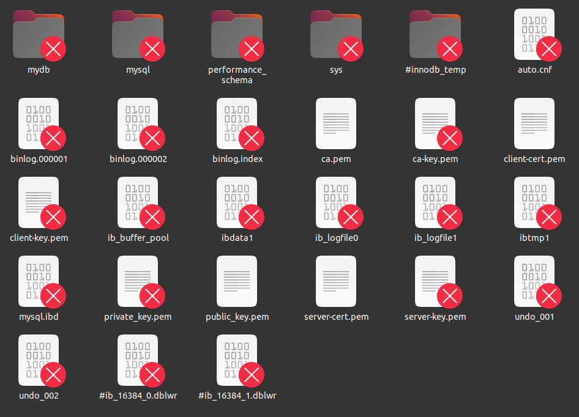
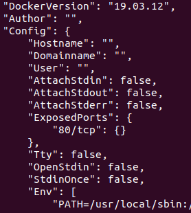
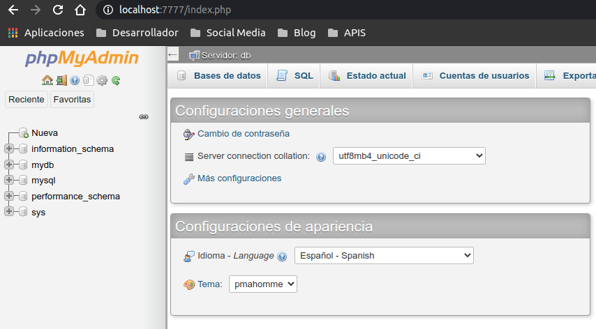
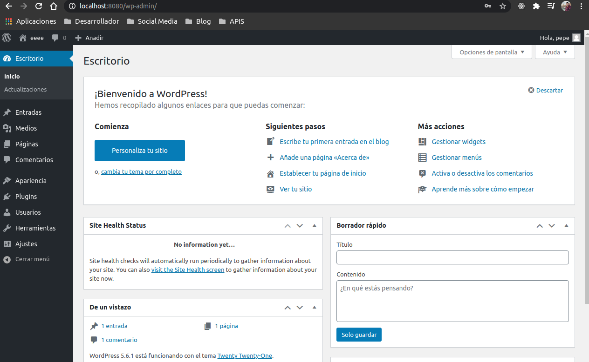
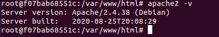

# Parte 2 Examen
- [Parte 2 Examen](#parte-2-examen)
  - [1 Creación del servicio database](#1-creación-del-servicio-database)
  - [2 Creación del servicio wordpress](#2-creación-del-servicio-wordpress)
  - [3 Creación del servicio phpmyadmin](#3-creación-del-servicio-phpmyadmin)
  - [4 Comprobar funcionamiento](#4-comprobar-funcionamiento)
  - [5 Agregar redes a nuestro docker-compose](#5-agregar-redes-a-nuestro-docker-compose)
  - [6 Averiguar versión de apache de wordpress y phpmyadmin](#6-averiguar-versión-de-apache-de-wordpress-y-phpmyadmin)

## 1 Creación del servicio database

Imagen docker-hub: [link](https://hub.docker.com/repository/docker/soyl3y3nd4/simplewebdaw)

1. Como vamos a utilizar la última version de mysql, agregaremos `latest` a la imagen.
   ~~~
   version "3"
   services:
      database:
        image: mysql:latest
   ~~~
2. Le agregaremos el comando: `--default-authentication-plugin=mysql_native_password`.
   
   ~~~
   version "3"
   services:
      database:
        image: mysql:latest
        command: --default-authentication-plugin=mysql_native_password
   ~~~
3. Ahora crearemos un volumen para tener un respaldo de las bases de datos en local. Para ello nos crearemos una carpeta local llamada database_files y la enlazaremos al directorio donde se almacenan las BBDD en mysql, `/var/lib/mysql`.
   ~~~
   version "3"
   services:
      database:
        image: mysql:latest
        command: --default-authentication-plugin=mysql_native_password
        volumes: 
          - ./database_files:/var/lib/mysql
        environment:
          - MYSQL_ROOT_PASSWORD: admin
          - MYSQL_DATABASE: mydb
          - MYSQL_USER: user
          - MYSQL_PASSWORD: user
   ~~~
4. También debemos de inicializar las variables de entorno `MYSQL_ROOT_PASSWORD, MYSQL_DATABASE, MYSQL_USER, MYSQL_PASSWORD`.

5. Realizamos `$ docker-compose up`, y comprobamos el directorio databse_files, debería de contener algunos archivos.
   

___

## 2 Creación del servicio wordpress

1. Nos dirigimos previamente a docker-hub y buscamos wordpress. La última version será agregándole la etiqueta :latest. Adicionalmente se nos pide que sea accesible desde el puerto 6666, por lo tanto deberemos de comprobar primero que puerto es el que utiliza la imagen. 
   
2. Vamos a descargar la imagen y realizar un `docker inspect`.
   ~~~
   $ docker pull wordpress:latest
   $ docker inspect wordpress:latest
   ~~~
   
3. Ya sabemos a que puerto debemos redireccionar.
   ~~~
   wordpress:
      image: wordpress:latest
      ports:
         - 6666:80
   ~~~
4. Agregaremos un volumen para tener un respaldo de nuestra web.

   ~~~
   wordpress:
      image: wordpress:latest
      ports:
         - 6666:80
      volumes: ./wordpress_files:/var/www/html
   ~~~
5. Inicializaremos las variables de entorno `WORDPRESS_DB_HOST, WORDPRESS_DB_USER, WORDPRESS_DB_PASSWORD, WORDPRESS_DB_NAME`.
   ~~~
   wordpress:
      image: wordpress:latest
      ports:
         - 6666:80
      volumes: ./wordpress_files:/var/www/html
      environment:
        WORDPRESS_DB_HOST: db
        WORDPRESS_DB_USER: user
        WORDPRESS_DB_PASSWORD: user
        WORDPRESS_DB_NAME: wp_db
   ~~~
6. Adicionalmente le agregaremos `depends_on: database`, para que docker priorice el inicio de database.
   ~~~
   wordpress:
      image: wordpress:latest
      ports:
         - 6666:80
      volumes: ./wordpress_files:/var/www/html
      environment:
        WORDPRESS_DB_HOST: db
        WORDPRESS_DB_USER: user
        WORDPRESS_DB_PASSWORD: user
        WORDPRESS_DB_NAME: wp_db
      depends_on:
        - db
   ~~~

___
## 3 Creación del servicio phpmyadmin

1. Agregamos un nuevo servicio llamado phpmyadmin, le asignamos el `puerto 7777` y le vamos a inicializar la variable `PMA_HOST`. Como desconocemos el puerto, hacemos `$ docker pull phpmyadmin:latest` y seguido un `$ docker inspect phpmyadmin:latest`. Podemos observar que en exposed ports nos indican el 80.

   ~~~
   phpmyadmin:
      image: phpmyadmin:latest
      ports:
         - 7777:80
      environment:
         PMA_HOST: db 
   ~~~

## 4 Comprobar funcionamiento
1. Después de haber juntado los 3 servicios nos ha quedado el archivo así:
   ~~~
   version: "3"
    services:
        db:
            image: mysql:latest
            volumes:
                - ./database_files:/var/lib/mysql
            command: --default-authentication-plugin=mysql_native_password
            environment:
                MYSQL_ROOT_PASSWORD: admin
                MYSQL_DATABASE: mydb
                MYSQL_USER: user
                MYSQL_PASSWORD: user

    wordpress:
        image: wordpress
        ports:
            - 8080:80
        volumes:
            - ./wordpress_files:/var/www/html
        environment:
            WORDPRESS_DB_HOST: db
            WORDPRESS_DB_USER: user
            WORDPRESS_DB_PASSWORD: user
            WORDPRESS_DB_NAME: mydb
        depends_on:
            - db

    phpmyadmin:
        image: phpmyadmin:latest
        ports:
            - 7777:80
        environment:
            PMA_HOST: db
        depends_on:
            - db
   ~~~

2. Realizamos `$ docker-compose up` y deberiamos de poder acceder a `localhost:7777` y `localhost:8080`.

   
   

## 5 Agregar redes a nuestro docker-compose

1. Para agregar redes, las crearemos al final del archivo, de forma que quede paralelo a `services:`, y dentro del el crearemos `fronttier` y `backtier`.

~~~
networks:
   fronttier:
   backtier:
~~~

2. Ahora hay que coger estas redes y asignarlas a nuestros servicio. A db le vamos a asignar la red `backtier` y a worpress y phpmyadmin ambas, porque requieren de acceso a la misma.
   
   

   ~~~
    version: "3"
    services:
        db:
            image: mysql:latest
            volumes:
                - ./database_files:/var/lib/mysql
            command: --default-authentication-plugin=mysql_native_password
            environment:
                MYSQL_ROOT_PASSWORD: admin
                MYSQL_DATABASE: mydb
                MYSQL_USER: user
                MYSQL_PASSWORD: user
            networks:
                - backtier
        wordpress:
            image: wordpress
            ports:
                - 8080:80
            volumes:
                - ./wordpress_files:/var/www/html
            environment:
                WORDPRESS_DB_HOST: db
                WORDPRESS_DB_USER: user
                WORDPRESS_DB_PASSWORD: user
                WORDPRESS_DB_NAME: mydb
            depends_on:
                - db
            networks:
                - backtier
                - fronttier
        phpmyadmin:
            image: phpmyadmin:latest
            ports:
                - 7777:80
            environment:
                PMA_HOST: db
            depends_on:
                - db
            networks:
                - backtier
                - fronttier
    networks:
        fronttier:
        backtier:
    ~~~

## 6 Averiguar versión de apache de wordpress y phpmyadmin

1. Para realizar esto lo que debemos de hacer es ejecutar una imagen de cada uno en modo interactivo y mediante terminal comprobar la versión. Para wordpress lo hacemos de la siguiente forma:
   ~~~
   $ docker run --rm -it wordpress /bin/bash
   $ apache2 -v
   Server version: Apache/2.4.38 (Debian)
   Server built:   2020-08-25T20:08:29
   ~~~

    Respuesta:**Version 2.4.38 (Debian)**

2. Comprobamos la versión de phpmyadmin.
   ~~~
   $ docker run --rm -it phpmyadmin /bin/bash
   $ apache2 -
   Server version: Apache/2.4.38 (Debian)
   Server built:   2020-08-25T20:08:29
   ~~~

    Respuesta:**Version 2.4.38 (Debian)**
