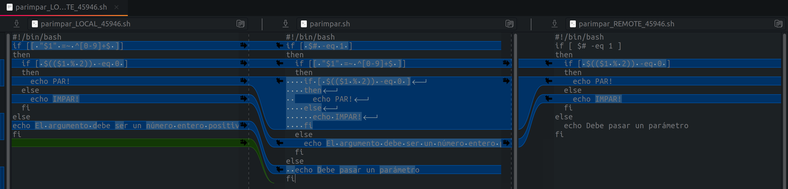

# GitHub
https://www.diegocmartin.com/tutorial-git/

Git es un controlador de versiones
Toma instantáneas del código en un estado determinado, autor y fecha.

`Commit` es una imagen formada por un conjunto de cambiar guardados en el repositorio

`head` es el puntero al último commit de rama activa

Para saber si tenemos git configurado en el equipo:
~~~
$ git config --global --list 
~~~

## Configurar Email y Usuario

Como mínimo debemos configurar el nombre y el email en la aplicación con los siguientes comandos:

Para configurar el usuario:
~~~
$ git config --global user.name <<nombre usuario>>
~~~

Para configurar el email:
~~~
$ git config --global user.email <<email>>
~~~

Para comprobar podemos usar:

~~~
$ git config --global --list
~~~

## Trabajar con GIT

Ahora con git init y el nombre del proyecto, creamos un nuevo proyecto:
~~~
$ git init <<nombre proyecto>>
~~~

Con el siguiente comando podemos saber el estado de la carpeta GIT:
~~~
$ git status
~~~

Creamos un archivo
~~~
$ nano README.md
~~~
Si volvemos a hacer `git status` podemos comprobar que el archivo nuevo esta ahí pero no está agregado al controlador de versiones. Lo agregamos al controlador de versiones para que lo vigile.

~~~
$ git add README.md
~~~

Creamos otro archivo:
~~~
$ nano archivo.txt
~~~

Ahora si modificamos README.md y hacemos `git status` podemos comprobar que nos aparece una archivo para actualizar y otro para incluir.

`-a` para que guarde todos los archivo que han cambiado, y `m` para el mensaje, creará una nueva imagen.

~~~
$ git commit -am "cambios"
~~~

Parsa ver los cambios
~~~
$ git log
~~~

Entramos dentro de una carpeta
~~~
$ git init
~~~

Agregar todos los archivos que hay en la carpeta:
~~~
$ git add .
~~~
Esto afecta a todos los archivos recursivamente, afectando a los que esten también dentro de los subdirectorios.

Crear imagen de todo el directorio, una instantánea de todo
~~~
$ git commit -am "primer commit a todo"
~~~

Si modificamos un archivo, habría que confirmar los cambios con un commit.

1. Creamos cuenta GIT.
   
2. Nos dirigimos a la carpeta raíz de usuario, creamos una carpeta llamada .ssh. Nos movemos a ella y mediante el comando shh-keygen creamos una clave asociada a la cuenta de correo. Vamos a emplear una clave tipo RSA, de modo que el comando quedaría:
    ~~~~
    ssh-keygen -t rsa -C “correo@dominio.com”
    ~~~~

3. Enter, enter y por defecto nos crea la clave en ~/.shh/id_rsa.pub

4. cat ~/.ssh/id_rsa.pub y nos aparecerá la clave, la copiamos.
   
5. Ahora iniciamos sesión en GitHub y nos vamos a Settings à SSH Keys y creamos una nueva, indicando un nombre descriptivo y la clave pública que hemos copiado previamente.
   
6. Introducimos en la terminal ssh -T git@github.com y deberíamos autenticarnos correctamente.

### Comandos Git
Comandos y manual
~~~
$ git commit -h 
$ man git 
~~~

borrar directorio que contenga archivos
~~~
rm -r .git
~~~
borrar directorio que contenga también algún archivo de sólo lectura
~~~
rm -rf .git
~~~

~~~
git push
git pull
git clone link-repo
git add .
git commit
git remote add origin
~~~

# GIT
una vez añadida la ssh a nuestro pc, creamos un directorio, realizamos git init, y hacemos un git clone `direccion ssh`.

Se nos copiará el repositorio remoto en el local.

Creamos archivos, carpetas o modificamos cosas.
git add `archivo`
git push

Cuando lleguemos a casa `git pull` para actualizar nuestro repositorio local con el que hay en el remoto.

## Sistemas de control de veriones (GIT)

* * * 
## 1. **Repositorios remotos (Github)**

Antes de comenzar crearemos un repositorio en 
[GitHub](https://github.com/soyl3y3nd4/)

1. Crear un repositorio local
   ~~~
   $git init
   ~~~
2. Agregar todo el contenido.
   ~~~
   $ git add .
   ~~~
3. Relizar un commit.
   ~~~
   $ git commit -am "primer commit"
   ~~~
4. Agregar el repositorio remoto al local
   ~~~
   $ git remote add origin git@github.com:soyl3y3nd4/prueba.git
   ~~~
5. Subir el repositorio local al remoto.
   ~~~
   $ git push -u origin master
   ~~~

* * *
## 2. **Integración (merge)**
1. Comprobamos en que rama nos encontramos con `git status`
2. Creamos una nueva rama.
   ~~~
   $ git branch nombre_rama
   ~~~

   O también podemos hacerlo así para crearla y situarnos directamente en ella.

   ~~~
   $ git checkout -b nombre_rama
   ~~~

3. Seguimos situados en la rama **master**, para cambiar a la rama deseada.
   ~~~
   $ git checkout nombre_rama
   ~~~
4. Moficamos cosas en la nueva rama y realizamos un **commit**
   ~~~
   $ commit -am "commit en nueva rama"
   ~~~
5. Podemos comprobar el estado de las ramas con `git log`
   
6. Al finalizar con la rama debemos cambiar a la rama **master** y realizar un **merge**.
   ~~~
   $ git checkout master

   $ git merge nombre_rama
   ~~~

   En caso de haber conflictos nos avisará de ello, y deberemos resolverlos o bien manualmente o con alguna herramienta, en caso contrario ya tendremos finalizado el repositorio y preparado para subirlo a un repositorio remoto.

* * *
#### Conflictos (resolución manual)

Para corregir el archivo manualmente solo tenemos que editarlo con `nano`. Podemos seleccionar texto con la tecla mayúscula y el cursor, cortarlo con `ctrl+k` y pegarlo con `ctrl+u`. El resultado será este:

~~~
#!/bin/bash
if [ $# -eq 1 ]
then
  if [[ "$1" =~ ^[0-9]+$ ]]
  then
    if [ $(($1 % 2)) -eq 0 ]
    then
      echo PAR!
    else
      echo IMPAR!
    fi
  else
    echo El argumento debe ser un número entero positivo
fi
else       
  echo Debe pasar un parámetro
fi
~~~

* * *
#### Conflictos (resolución con meld)

para usar una herramienta de resolución de conflictos usamos el comando `git mergetool`. Esto nos permite seleccionar la herramienta que queramos de entre las que está instaladas:

~~~
$ git mergetool
~~~

Si no hay ninguna herramienta instalada aparecerá el siguiente mensaje:

~~~
This message is displayed because 'merge.tool' is not configured.
See 'git mergetool --tool-help' or 'git help config' for more details.
'git mergetool' will now attempt to use one of the following tools:
meld opendiff kdiff3 tkdiff xxdiff tortoisemerge gvimdiff diffuse diffmerge ecmerge p4merge araxis bc codecompare smerge emerge vimdiff
Merging:
parimpar.sh

Normal merge conflict for 'parimpar.sh':
  {local}: modified file
  {remote}: modified file
Hit return to start merge resolution tool (bc): 
The merge tool bc is not available as 'bcompare'
~~~

Para configurar una herramienta primero la instalamos. 
~~~
$ sudo apt install meld
~~~

una vez inatalada, podemos configurarla como la herramienta por defecto:

~~~
git config --global merge.tool meld
git config --global diff.tool meld
git config --global difftool.prompt false
~~~

ahora probamos de nuevo:

~~~
$ git mergetool
~~~

Noa aparece la siguiente ventana:

en ella podemos hacer los cambios pertinentes para dejar el archivo en su estado correcto. El resultado será este:

Pulsamos el botón `Guardar` y salimos de la herramienta.

##### Confirmación de los cambios

Una vez hechos los cambios hay que actualizar el repositorio. Si vemos el estado, nos mostrará instrucciones sobre los siguientes pasos:

~~~
$ git status
On branch master
You have unmerged paths.
  (fix conflicts and run "git commit")
  (use "git merge --abort" to abort the merge)

Unmerged paths:
  (use "git add <file>..." to mark resolution)
	both modified:   parimpar.sh

no changes added to commit (use "git add" and/or "git commit -a")
~~~

Si hacemos caso a las indicaciones, deberíamos guardar los cambios en el repositorio haciendo un *commit*:

~~~
$ git commit -am 'merged with branches bug_1, bug_2'
$ git status
On branch master
nothing to commit, working tree clean
~~~

si miramos el log, vemos todos los *commits*, incluidos los de las dos ramas:

~~~
commit 28345406d835c84aa433c7242ab38ceb23da13df (HEAD -> master)
Merge: 9fa6dbe 1305211
Author: Emilio Sansano <esansano@uji.es>
Date:   Thu Oct 1 18:53:52 2020 +0200

    merged with branches bug_1, bug_2

commit 1305211bf85934334c42dd7fd4caa6f0ff05850a (bug_2)
Author: Emilio Sansano <esansano@uji.es>
Date:   Thu Oct 1 17:25:53 2020 +0200

    bugfix: bug 2

commit 9fa6dbec77fcfa0953a06a65a990601f9091b831 (bug_1)
Author: Emilio Sansano <esansano@uji.es>
Date:   Thu Oct 1 14:10:17 2020 +0200

    bugfix: bug 1

commit e6d5f9bb2be15ad6710077f829821766acb5844a
Author: Emilio Sansano <esansano@uji.es>
Date:   Thu Oct 1 09:50:28 2020 +0200

    version 1.0

~~~

Si queremos borrar las ramas una vez integradas, podemos hacerlo con `git branch -d`:

~~~
$ git branch -d bug_1
Deleted branch bug_1 (was 9fa6dbe).
$ git branch -d bug_2
Deleted branch bug_2 (was 1305211).
~~~

Si miramos el *log* ya no vemos referencias a las ramas, solo tenemos los commits:

~~~
$ git log
commit 28345406d835c84aa433c7242ab38ceb23da13df (HEAD -> master)
Merge: 9fa6dbe 1305211
Author: Emilio Sansano <esansano@uji.es>
Date:   Thu Oct 1 18:53:52 2020 +0200

    merged with branches bug_1, bug_2

commit 1305211bf85934334c42dd7fd4caa6f0ff05850a
Author: Emilio Sansano <esansano@uji.es>
Date:   Thu Oct 1 17:25:53 2020 +0200

    bugfix: bug 2

commit 9fa6dbec77fcfa0953a06a65a990601f9091b831
Author: Emilio Sansano <esansano@uji.es>
Date:   Thu Oct 1 14:10:17 2020 +0200

    bugfix: bug 1

commit e6d5f9bb2be15ad6710077f829821766acb5844a
Author: Emilio Sansano <esansano@uji.es>
Date:   Thu Oct 1 09:50:28 2020 +0200

    version 1.0
~~~

