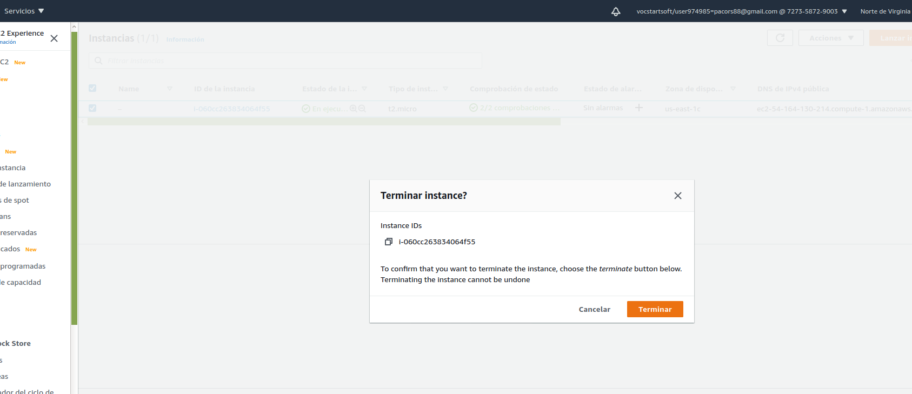
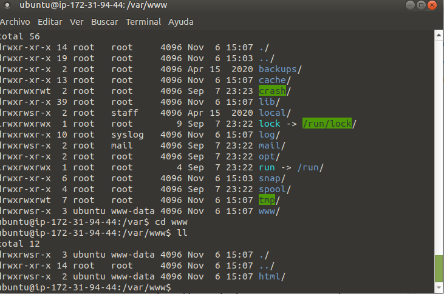
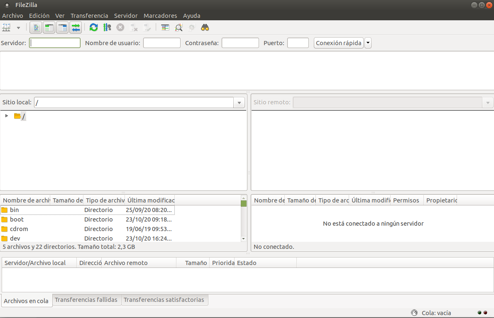

- [AWS](#aws)
  - [**Crear claves**](#crear-claves)
  - [**Grupos de seguridad**](#grupos-de-seguridad)
    - [Reglas de entrada](#reglas-de-entrada)
  - [Instancias](#instancias)
- [Instalación de un servidor web LAMP en Amazon Linux 2](#instalación-de-un-servidor-web-lamp-en-amazon-linux-2)
  - [Probar el servidor LAMP](#probar-el-servidor-lamp)
    - [Para establecer permisos de archivo](#para-establecer-permisos-de-archivo)
  - [Probar el servidor LAMP](#probar-el-servidor-lamp-1)
  - [Proteger el servidor de base de datos](#proteger-el-servidor-de-base-de-datos)
  - [Instalar phpMyAdmin](#instalar-phpmyadmin)
- [UBUNTU](#ubuntu)
- [FileZilla](#filezilla)

# AWS
 Tutorial EC" en google

 [enlace](https://docs.aws.amazon.com/ec2/index.html)
 [enlace]()

## **Crear claves**
Desde la instancia, deberemos crear un par de claves.

pem -> Mac o Linux
ppk -> Linux

Guarda la clave en un lugar seguro.

## **Grupos de seguridad**
En los grupos de seguridad, estableceremos reglas para regular que tipo de tráfico va a permitir el servidor.

Los grupos de seguridad vienen dados por zonas, si creamos uno en Virginia, sólo funcionará en Virgina. Por ello al crearlo le pondremos también el nombre de la zona para identificarlo.

### Reglas de entrada
Tipo: HTTP
Origen: Mi ip o cualquier lugar
Tipo: HTTPS
Origen: Mi ip o cualquier lugar
Tipo: SSH
Origen: Mi ip

Si cambia la ip nuestra, no podremos acceder.

Finalizar y Crear grupo de seguridad

## Instancias
Instancias > Lanzar instancia. Las que ponen `Free tier eligible` son gratuitas.
Seleecionamos la que queremos pulsando `Select`.

`Review and Launch` a la máquina que queremos.
Nos llevará a la página de la instancia.
Seleccionamos nuestro grupo de seguridad y en la página de **Review** ya podremos ver el grupo añadido.

Le damos a `Launch` y nos avisa de la clave que hay que elegir, y que sabemos que si perdemos el archivo de la key no podremos acceder a la máquina.

Si todo ha ido correcto, `nos dirá que la Instancia está siendo ejecutada`.

Pasamos a ver las instancias.

Abriremos la consola y con el comando siguiente agregremos nuestro archivo con las keys
`ssh -i /path/my-key-pair.pem my-instance-user-name@my-instance-public-dns-name`

vamos al directorio home de la máquina.

1. Instalar apache
~~~
yum install httpd
~~~
Ver que versión de apache tenemos instalada
~~~
httpd -v
~~~
Ver el estado del servicio
~~~
sudo systemctl status httpd
~~~
Apache escucha un puerto, y en función de lo que le llegue envia la petición al módulo que corresponda y devuelve lo que se esté pidiendo.

Activar apache:
~~~
sudo systemctl enable httpd
~~~

Ejecutar el servicio:
~~~
$ sudo systemctl start httpd
~~~

Comprobamos el stado de apache de nuevo: 
~~~
$ sudo systemctl status httpd
~~~

Introducimos la ip en el navegador `54.164.130.214`, y nos abre la test page de `Apache`.

Acceder al directorio donde se almacenan las webs:
~~~
$ cd /var/www
~~~

Creamos nuestro index.html y creamos nuestra web
~~~
$ cd html
$ sudo nano index.html
~~~

Instalar manual de Apache
~~~
$ sudo yum install httpd-manual
~~~

Acceder
~~~
$ sudo nano /etc/httpd/conf/httpd.conf
~~~

Cerrar sesion de la máquina
~~~
exit
~~~

Pasamos a la página de AWS, seleccionamos la instancia y buscamos la pestaña de acciones:

Estado de la instancia > Terminar instancia

https://docs.aws.amazon.com/es_es/AWSEC2/latest/UserGuide/ec2-lamp-amazon-linux-2.html#setting-file-permissions-2

# Instalación de un servidor web LAMP en Amazon Linux 2

## Probar el servidor LAMP

1. Conectarse a la instancia.
2. Para asegurarse de que todos los paquetes de software están actualizados, realice una actualización rápida del software en la instancia. Este proceso puede durar unos minutos, pero es importante realizarlo para asegurarse de que tiene las actualizaciones de seguridad y las correcciones de errores más recientes. La opción -y instala las actualizaciones sin necesidad de confirmación. Si le gustaría examinar las actualizaciones antes de la instalación, puede omitir esta opción. 

~~~
$ sudo yum update -y
~~~

3. Instale los repositorios lamp-mariadb10.2-php7.2 y php7.2 Amazon Linux Extras para obtener las versiones más recientes de los paquetes LAMP MariaDB y PHP de Amazon Linux 2.

~~~
$ sudo amazon-linux-extras install -y lamp-mariadb10.2-php7.2 php7.2
~~~

Si recibe el error que indica sudo: amazon-linux-extras: command not found, entonces la instancia no se lanzó con una AMI; de Amazon Linux 2 (quizás está utilizando la Amazon Linux AMI en su lugar). Puede ver la versión de Amazon Linux usando el comando siguiente: 
~~~
$ cat /etc/system-release
~~~

4. Ahora que la instancia está actualizada, puede instalar los paquetes de software PHP, MariaDB y el servidor web Apache. Utilice el comando yum install para instalar varios paquetes de software y todas las dependencias relacionadas al mismo tiempo. 

~~~
$ sudo yum install -y httpd mariadb-server
~~~

5. Inicie el servidor web Apache.

~~~
$ sudo systemctl start httpd
~~~

6. Utilice el comando systemctl para configurar el servidor web Apache de forma que se inicie cada vez que arranque el sistema.

~~~
$ sudo systemctl enable httpd
~~~
Utilice el comando systemctl para configurar el servidor web Apache de forma que se inicie cada vez que arranque el sistema.
~~~
$ sudo systemctl is-enabled httpd
~~~

### Para establecer permisos de archivo

1. Añada el usuario (en este caso, el usuario ec2-user) al grupo apache.
~~~
$ sudo usermod -a -G apache ec2-user
~~~

2. Cerrar sesión.
~~~
$exit
~~~
Volver a conectar a la máquina.
~~~
$ ssh -i pc-agil-centros.pem ec2-user@54.164.130.214
~~~
Verificar si el usuario pertenece al grupo apache

~~~
[ec2-user ~]$ groups
ec2-user adm wheel apache systemd-journal
~~~
3. Cambie la propiedad de grupo de /var/www y su contenido al grupo apache.
~~~
$ sudo chown -R ec2-user:apache /var/www
~~~

4. Para agregar permisos de escritura de grupo y establecer el ID de grupo en futuros subdirectorios, cambie los permisos del directorio /var/www y sus subdirectorios. 

~~~
$ sudo chmod 2775 /var/www && find /var/www -type d -exec sudo chmod 2775 {} \;
~~~

5. Para agregar permisos de escritura de grupo, cambie recursivamente los permisos de archivo de /var/www y sus subdirectorios: 
~~~
$ find /var/www -type f -exec sudo chmod 0664 {} \;
~~~

## Probar el servidor LAMP

Si todo está correcto podemos crear un archivo php y acceder a él:
~~~
echo "<?php phpinfo(); ?>" > /var/www/html/phpinfo.php
~~~
Poner en el navegador http://my.public.dns.amazonaws.com/phpinfo.php

En caso de no estar correcto, con el siguiente comando se comprueban si están instalados los paquetes necesarios: 

~~~
$ sudo yum list installed httpd mariadb-server php-mysqlnd
~~~

Eliminar el archivo creado anteriormente `phpinfo.php`:
~~~
$ rm /var/www/html/phpinfo.php
~~~

## Proteger el servidor de base de datos

Iniciar servidor MAriaDB
~~~
$ sudo systemctl start mariadb
~~~

Ejecute mysql_secure_installation. 

~~~
$ sudo mysql_secure_installation
~~~
Pulsar `Y` para confirmar contraseña e insertar 2 veces. `Y`, `Y`, `Y`, `Y` 

En el caso de no querer usar MariaDb, detener:
~~~
$ sudo systemctl stop mariadb
~~~

En caso de querer usarla, con el siguiente comando MariaDB se iniciará al arrancar el sistema:
~~~
$ sudo systemctl enable mariadb
~~~

## Instalar phpMyAdmin

Instalar dependencias:
~~~
sudo yum install php-mbstring -y
~~~

Reiniciar Apache:
~~~
sudo systemctl restart httpd
~~~

Reiniciar php-fpm:
~~~
sudo systemctl restart php-fpm
~~~
Ir a la raíz de documentos Apache:
~~~
cd /var/www/html
~~~
Seleccionar el paquete de phpMyAdmin mas reciente, crear la carpeta phpmyadmin y eliminar el .tar

~~~
$ wget https://www.phpmyadmin.net/downloads/phpMyAdmin-latest-all-languages.tar.gz
$ mkdir phpMyAdmin && tar -xvzf phpMyAdmin-latest-all-languages.tar.gz -C phpMyAdmin --strip-components 1
$ rm phpMyAdmin-latest-all-languages.tar.gz
~~~

Si MariaDB está funcionando, obviar este paso, en caso contrario:
~~~
$ sudo systemctl start mariadb
~~~

Entrar en nuestra direccion ip:

`http://direccionip/phpMyAdmin`

Usuario: `root` y nuestra `password`

~~~
$ mkdir academia
$ mkdir tienda

$ nano tienda/index.html
$ nano academia/index.html
~~~

Procedemos a configurar apache para que reconozca las webs
~~~
$ cd /etc/httpd/conf.d/
~~~
Aquí dentro todo es de usuario root, para crear archivos necesitamos hacerlo con sudo

~~~
$ sudo nano tienda.conf
~~~ 

Con esto le decimos que creamos un virtualhost que se puede acceder desde cualquier IP con el puerto 80, con DocumentRoot le decimos el directorio de la carpeta donde está ubicada la web, y él ya sen encargará de buscar el index.html, .php, etc..
~~~
<VirtualHost *:80>
    DocumentRoot /var/www/tienda
</VirtualHost>
~~~

Reiniciamos apache para que reconozco los cambios, cada vez que cambiemos la configuracion de apache, es RECOMENDABLE introducir el siguiente comando:

~~~
$ sudo apachectl configtest
~~~
En caso de estar correcto nos responde con el mensaje `Syntax OK`, en caso contrario nos mostrará la ubicación del error y no dejará arrancar Apache, reiniciamos:
~~~
$ sudo systemctl restart httpd
~~~

Agregar otra página web en otro puerto, en este caso el 8080

Creamos los pasos anteriores a diferencia del `conf` que le tendremos que indicar que escuche el puerto 8080.
~~~
Listen 8080
<VirtualHost *:8080>
  DocumentRoot /var/www/academia
</VirtualHost>
~~~

Ahora en nuestra web si accedemos con la ip normalnos abrirá una web, si añadimos el puerto :8080 nos abrirá otra.

Un servidor apache puede servir a distintos dominios y distintas ip's.

Creamos una página dentro de tienda
~~~
$ mkdir /var/www/www/tienda/admin
$ nano /var/www/www/tienda/admin/index.html
~~~

Creamos una carpeta para guardar las credenciales de usuarios
~~~
$ sudo mkdir /etc/httpd/password
~~~

~~~
$ sudo htpasswd -c /etc/httpd/password/passwords-admin admin

$ sudo htpasswd -c /etc/httpd/password/passwords-admin `nombreusuario`
~~~
-c si no existe lo creará
password-admin es el nombre del archivo que vamos a crear.

Ahora nos dirigimos al archivo `.conf` que queremos proteger y lo editamos y agregamos lo siguiente
~~~
<Directory "/var/www/tienda/admin">
  AuthType Basic
  AuthName "administrador"
  AuthUserFile /etc/httpd/password/passwords-admin
  Require valid-user
</Directory>

~~~

# UBUNTU

Crear un grupo de seguridad:

Regla SSH siempre o no podremos conectarnos de manera remota:

Elegimos los puertos que nos indican, por defecto de http ES EL 80.

Lanzamos la instancia, le asignamos el grupo de seguridad, y le decimos la par de claves que vamos a usar.

Nos conectamos `pc-agil-centros.pem` `usuario`@`ip`:
~~~
ssh -i pc-agil-centros.pem ubuntu@52.90.41.221
~~~

Instalamos apache:
~~~
$ sudo apt install apache2
~~~

Comprobamos el estado de apache:

~~~
$ sudo systemctl status apache2
~~~

En ubuntu por defecto se habilita apache y se arranca sólo.

Dar permisos de usuario donde `ubuntu` es nuestro usuario:
~~~
$ sudo usermod -a -G www-data ubuntu
~~~
exit y volver a entrar, si escribimos `groups` deberiamos de estar en el grupo `www-data`

~~~
sudo chown -R ubuntu:www-data /var/www

sudo chmod 2775 /var/www && find /var/www -type d -exec sudo chmod 2775 {} \;

find /var/www -type f -exec sudo chmod 0664 {} \;
~~~
Ahora en el directorio www deberiamos de tener permisos

Ahora dentro del directorio `html` creamos 2 directorios y dentro de cada uno su correspondientes index.html
~~~
mkdir biblioteca
mkdir taller
~~~

~~~
sudo nano etc/apache2/sites-available/taller.conf

<VirtualHost *:80>
  DocumentRoot /var/www/html/taller
</VirtualHost>

~~~
si comprobamos el directorio sites-enabled, podemos comprobar que sólo está el 000-default....

Le decimos, sudo apache2 enable site `taller` para habilitar el sitio:
~~~
sudo a2ensite taller

apachectl configtest

sudo systemctl reload apache2
~~~

Desabilitamos el sitio por defecto
~~~
sudo a2dissite 000-default
~~~
Reiniciamos apache y ya deberia funcionar

ahora en creamos el .conf de biblioteca de esta forma:

~~~
Listen 81
<VirtualHost *:81>
  DocumentRoot /var/www/html/biblioteca
</VirtualHost>
~~~
Habilitamos la nueva web
~~~
sudo a2ensite biblioteca
~~~

Ahora deberia de funcionar en el puerto 81

# FileZilla

Pulsar archivo, gestor de sitios...

Pulsar Nuevo sitio:
1. Introducir nombre
2. Introducir IP Servidor y Puerto (22 por defecto)
3. Protocolo: SFTP - SSH File Transfer Protocol
4. Modo de acceso: Key File
5. Usuario: ec2-user

