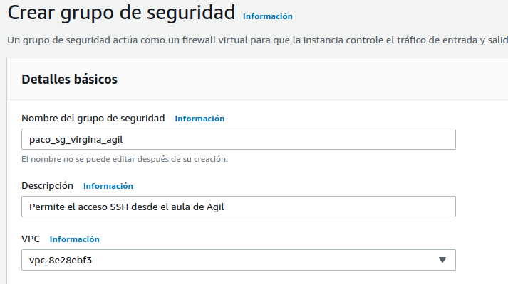
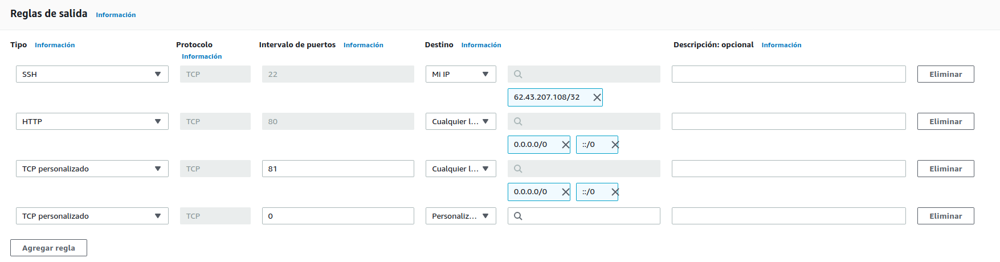
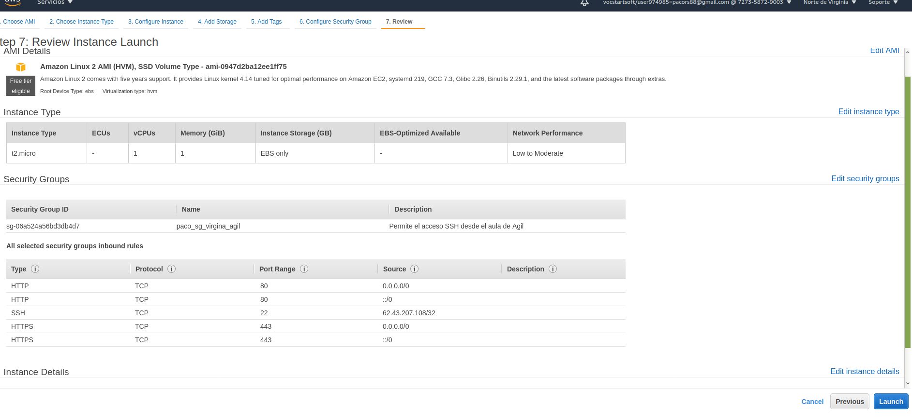
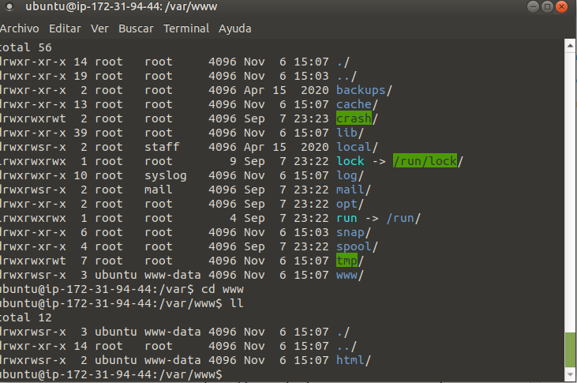

- [1. UBUNTU](#1-ubuntu)
  - [1.1 **Crear par de claves**](#11-crear-par-de-claves)
    - [1.1.1 **Reglas de entrada grupo de seguridad**](#111-reglas-de-entrada-grupo-de-seguridad)
  - [1.2 Instancias](#12-instancias)
    - [1.2.1 Conexión con instancia](#121-conexión-con-instancia)
  - [1.3 Instalación Apache](#13-instalación-apache)
  - [1.4 Creación de 2 directorios para 2 páginas](#14-creación-de-2-directorios-para-2-páginas)
  - [1.5 Autenticación BASIC](#15-autenticación-basic)
    - [1.5.1 Crear archivo de claves](#151-crear-archivo-de-claves)
    - [1.5.2 Editar .conf](#152-editar-conf)
    - [1.5.3 (opcional) Agregar grupos](#153-opcional-agregar-grupos)
  - [1.6 Autenticación DIGEST](#16-autenticación-digest)
    - [1.6.1 Carga módulo](#161-carga-módulo)
    - [1.6.2 Creación Fichero y Usuarios](#162-creación-fichero-y-usuarios)
    - [1.6.3 Editar .conf](#163-editar-conf)
  - [1.7 Instalación MariaDB](#17-instalación-mariadb)
  - [1.8 Instalación PHP](#18-instalación-php)
  - [1.9 Instalación phpMyAdmin](#19-instalación-phpmyadmin)
    - [1.9.1 Modificar acceso a phpMyAdmin](#191-modificar-acceso-a-phpmyadmin)
  - [(No es de examen) Auntenticación .HTACCESS](#no-es-de-examen-auntenticación-htaccess)
    - [Crear archivo de contraseña](#crear-archivo-de-contraseña)
    - [1.7.2 Habilitar restricción de directorio](#172-habilitar-restricción-de-directorio)
    - [Crear área restringida](#crear-área-restringida)

# 1. UBUNTU

* * *
## 1.1 **Crear par de claves**

Desde la instancia, deberemos crear un par de claves.

pem -> Mac o Linux
ppk -> Linux

Guarda la clave en un lugar seguro.

>
Los grupos de seguridad vienen dados por zonas, si creamos uno en Virginia, sólo funcionará en Virgina. Por ello al crearlo le pondremos también el nombre de la zona para identificarlo.

### 1.1.1 **Reglas de entrada grupo de seguridad**

1. `Tipo`: HTTP (puerto 80) ==== `Origen`: Mi ip o cualquier lugar

2. `Tipo`: TCP (puerto a elegir) ==== `Origen`: Mi ip o cualquier lugar

3. `Tipo`: SSH === `Origen`: Mi ip

En caso de no pedirnos puerto 80, no crearemos HTTP y sólo crearemos por TCP los puertos correspondientes.

La regla de entrada SSH debe estar siempre o no podremos conectarnos de forma remota.

Si cambia nuestra IP que tenemos en ese momento, no podremos acceder.
Puede ocurrir al reiniciar el router.

Darle a `Finalizar y Crear grupo de seguridad`

* * *
## 1.2 Instancias
Instancias > Lanzar instancia. Las que ponen `Free tier eligible` son gratuitas.
Seleecionamos la que queremos pulsando `Select`.

En nuestro caso `UBUNTU SERVER`.

`Review and Launch` a la máquina que queremos.
Nos llevará a la página de la instancia.
Seleccionamos nuestro grupo de seguridad y en la página de **Review** ya podremos ver el grupo añadido.

Le damos a `Launch` y nos avisa de la clave que hay que elegir, y que sabemos que si perdemos el archivo de la key no podremos acceder a la máquina.

Si todo ha ido correcto, `nos dirá que la Instancia está siendo ejecutada`.

* * *
### 1.2.1 Conexión con instancia

Nos conectamos mediante el siguiente comando `ssh -i **clave.pem** **usuario**@**dns o ip**`:
~~~
$ ssh -i pc-agil-centros.pem ubuntu@52.90.41.221
~~~

* * *
## 1.3 Instalación Apache

1. Instalamos apache y después comprobamos si se ha iniciado y arrancado (lo hace por defecto):
~~~
$ sudo apt install apache2
$ sudo systemctl status apache2
~~~

Como habremos observado, en ubuntu por defecto se habilita apache y se arranca sólo con lo que no necesitamos hacer nada más.

2. Dar permisos de usuario al directorio `www`, dónde `ubuntu` es nuestro usuario. Deberemos de hacer `exit` y volver a entrar para observar, si ingresamos `groups` en la consola, deberiamos de estar en el grupo `www-data`.

~~~
$ sudo usermod -a -G www-data ubuntu
~~~

3. Seguimos para dar permisos de escritura recursivamente al directorio:
~~~
$ sudo chown -R ubuntu:www-data /var/www

$ sudo chmod 2775 /var/www && find /var/www -type d -exec sudo chmod 2775 {} \;

$ find /var/www -type f -exec sudo chmod 0664 {} \;
~~~
Ahora en el directorio www deberiamos de tener permisos

* * *

## 1.4 Creación de 2 directorios para 2 páginas

1. Ahora dentro del directorio `html` creamos 2 directorios y dentro de cada uno su correspondientes index.html
~~~
$ mkdir biblioteca
$ mkdir taller
~~~

2. Creamos el .conf en el directorio `/etc/apache2/sites-available/nombre.conf` y escribiremos lo siguiente:

~~~
$ sudo nano etc/apache2/sites-available/taller.conf
~~~
~~~
<VirtualHost *:80>
  DocumentRoot /var/www/html/taller
</VirtualHost>

~~~
3. Si comprobamos el directorio `/etc/apache2/sites-enabled/`, podemos observar que sólo está activo el 000-default. Debemos de habilitar nuestros `.conf` para que comiencen a funcionar.

4. Le decimos, sudo apache2 enable site `taller` para habilitar el sitio que deseamos sudo a2ensite **nombre**, no es necesario poner la extensión `.conf`, seguidamente realizamos un configtest para comprobar sintaxis y reiniciamos Apache si todo está correcto:
~~~
$ sudo a2ensite taller

$ sudo apachectl configtest

$ sudo systemctl reload apache2
~~~

5. Debemos deshabilitar el sitio por defecto para que funcionen nuestros sitios, para deshabilitar:
~~~
$ sudo a2dissite 000-default
~~~

6. Reiniciamos apache y ya deberia funcionar

~~~
$ sudo systemctl reload apache2
~~~

7. Ahora en creamos el .conf de biblioteca de esta forma, hay que tener en cuenta que al no ser el puerto por defecto, hemos de comenzar con Listen **numero de puerto**:

~~~
Listen 81
<VirtualHost *:81>
  DocumentRoot /var/www/html/biblioteca
</VirtualHost>
~~~

8. Habilitamos la nueva web
~~~
$ $ sudo a2ensite biblioteca
~~~

9. Reiniciamos apache y ya deberia funcionar ambas webs en sus respectivos puertos.

~~~
$ sudo systemctl reload apache2
~~~

* * *

## 1.5 Autenticación BASIC

### 1.5.1 Crear archivo de claves

Ahora debemos crear el archivo que almacenará las claves, y el que deberemos indicar en el `.conf` mediante su ruta para proteger ese directorio, en el caso de que el archivo ya esté creado, no pondremos `-c`, después se nos solicitará introducir una contraseña 2 veces.
~~~
sudo mkdir /etc/apache2/passwords

sudo htpasswd -c /etc/apache2/passwords/passwords-admin nombre_usuario

~~~

### 1.5.2 Editar .conf

Una vez creado el directorio que queremos proteger, nos dirigimos a su `.conf` y lo editamos de la forma siguiente:
~~~
Listen 81
<VirtualHost *:81>
  DocumentRoot /var/www/html/biblioteca
</VirtualHost>

<Directory "/var/www/html/biblioteca/administracion">
  AuthType Basic
  AuthName "Mensaje para el login"
  AuthUserFile /etc/apache2/password/passwords-admin
  Require valid-user
</Directory>
~~~

De esta forma, cuando un usuario quiera acceder al directorio administración, deberá estar autenticado.
Comprobamos sintaxis y si recibimos un OK, recargamos apache:
~~~
$ sudo apachectl configtest

$ sudo systemctl reload apache2
~~~

### 1.5.3 (opcional) Agregar grupos
Crearemos un archivo por ejemplo, en el mismo directorio en el que tenemos el archivo de usuarios y en su interior escribiremos tal cual:
~~~
$ cd /etc/apache2/
$ sudo nano grupos.txt

grupo_uno: pepe maria juan
grupo_dos: francisco sebastian
~~~
Activamos módulo de grupos y posteriormente reiniciamos apache:
~~~
$ sudo a2enmod authz_groupfile

$ sudo systemctl restart apache2
~~~
Ahora hay que cambiar el contenido del `.conf` del directorio para que limite el acceso por grupos, para ello hemos de agregar la línea `AuthGroupFile nombre_fichero_grupos` y en el valor `Require valid-user` lo modificaremos por el `Require group` y seguido separado por espacios los grupos que queremos que tengan acceso:

~~~
<Directory "/var/www/html/biblioteca">
   Order deny,allow
   AuthUserFile "/etc/apache2/claves.txt"
   AuthGroupFile "/etc/apache2/grupos.txt"
   AuthName "Mensaje para la identificación"
   AuthType Basic
   Require group grupo1 grupo2
</Directory>
~~~

Ahora sólo permitirá el acceso a usuarios que esten incluidos en el grupo1 y grupo2.

* * *
## 1.6 Autenticación DIGEST

### 1.6.1 Carga módulo
En caso de que el módulo de autenticación DIGEST ya estuviera habilitado nos aparecería listado en `/etc/apache2/mods-enabled` como **auth_digest**. Si queremos consultar los módulos disponibles, podemos hacerlo en `etc/apache2/mods-available`. Para empezar debemos cargar el modulo DIGEST y reiniciar apache2:
~~~
$ sudo a2enmod auth_digest
$ sudo systemctl restart apache2
~~~

### 1.6.2 Creación Fichero y Usuarios

1. Nos dirigimos a la carpeta de configuración de apache y crearemos un fichero de claves, `-c` para crearlo en caso de que no existiera. Debemos pasarle como parámetro un string entre comillas que luego pondremos de la misma forma en el `.conf`, y como segundo parámetro el nombre de usuario. Si todo ha ido bien nos responderá `Adding password for nombre_usuario in realm nombre_grupo` y nos solicitará introducir una password 2 veces.

~~~
$ sudo htdigest -c /etc/apache2/passwords/passwords-digest "grupo1" admin
~~~

2. Si queremos agregar otro usuario, deberemos de introducir el comando exactamente igual, pero quitando `-c` e introduciendo un nombre de usuario distinto, por ejemplo:

~~~
$ sudo htdigest /etc/apache2/password/passwords-digest "Configuracion" admin2
~~~

### 1.6.3 Editar .conf

Ahora deberemos de editar el `.conf` del directorio que queremos proteger situado en el directorio `/etc/apache2/sites-available/`:

~~~
<VirtualHost *:80>
  DocumentRoot /var/www/croquetas
</VirtualHost>

<Directory "/var/www/croquetas/configuracion">
  AuthType Digest
  AuthName "grupo1"
  AuthUserfile /etc/apache2/password/passwords-digest
  Require valid-user
</Directory>

~~~

Comprobamos sintaxis, y si recibimos un `Syntax OK`, recargamos apache y listo!
~~~
$ sudo apachectl configtest

$ sudo systemctl restart apache2
~~~

* * * 
## 1.7 Instalación MariaDB

1. Primero actualizamos paquetes e instalamos MariaDB:
~~~
$ sudo apt update

$ sudo apt install mariadb-server
~~~

2. Después debemos hacer que el servidor de mysql sea seguro:
~~~
$ sudo mysql_secure_installation
~~~
3. Nos pedirá contraseña de root, (por defecto está vacía), pulsar `Y` para confirmar, introducimos la contraseña nueva elegida 2 veces. Nos pregunta si queremos borrar usuarios anónimos: `Y`. Deshabilitar login remoto de root: `Y`. Borrar BBDD de test: `Y`. Recargar tablas de privilegios: `Y`.

* * * 
## 1.8 Instalación PHP

Instalacion de php y sus modulos dependientes:
~~~
$ sudo apt install php libapache2-mod-php php-mysql
~~~

* * * 
## 1.9 Instalación phpMyAdmin

Instalación de phpmyadmin y sus dependencias:
~~~
$ sudo apt install phpmyadmin php-mbstring php-zip php-gd php-json php-curl
~~~

Debemos seleccionar **apache2**, debe salir un asterisco en el cuadrado con la opción seleccionada, con el tabulador nos movemos hasta el *Ok*.

La siguiente ventana le decimos que **Yes**, despues introducimos una contraseña y nos devolverá a la consola, reiniciamos apache.

~~~
$ sudo systemctl restart apache2
~~~

### 1.9.1 Modificar acceso a phpMyAdmin

Si intentamos acceder a **phpMyAdmin** no nos dejará autenticarnos, para ello debemos de cambiar el tipo de plugin con las siguientes instrucciones:

1. Ejecutamos MySQL, nos llevará a la consolda de MariaDB.
~~~
$ sudo mysql
~~~

2. Hacemos una consulta para ver los datos del login:
~~~
SELECT user,authentication_string,plugin,host FROM mysql.user;
~~~
Tenemos que cambiar el plugin de `unix_socket` para que nos permita hacer login.

3. Introducimos la instrucción siguiente:
~~~

SET PASSWORD = PASSWORD("1234");

ALTER USER root@localhost IDENTIFIED VIA mysql_native_password;

~~~

Si volvemos a hacer la consulta, comprobaremos que ha cambiado el plugin a **mysql_native_password**.

Reiniciamos mysql y ya deberiamos de poder loguearnos en phpMyAdmin como `root` y la contraseña introducida en el paso de instalación de **phpMyAdmin**.

~~~
sudo systemctl restart mysql
~~~

## (No es de examen) Auntenticación .HTACCESS
https://www.linuxenespañol.com/tutoriales/proteger-un-directorio-apache-con-contrasena/

### Crear archivo de contraseña
El primer paso es crear un archivo de contraseña que Apache usará para verificar usuario y contraseña. Debemos llamarlo `.htpasswd` y lo colocaremos en: `/etc/apache2/`
~~~
$ sudo htpasswd -c /etc/apache2/.htpasswd nombre-usuario
~~~
Seguidamente nos pedirá la contraseña 2 veces.

**Si el archivo ya existiera, debemos introducir el mismo comando pero obviando `-c`.**

### 1.7.2 Habilitar restricción de directorio

Antes de restringir directamente el directorio, debemos editar el archivo `apache2.conf`, situado en  `/etc/apache2/`:
~~~
$ sudo nano /etc/apache2/apache2.conf
~~~
Buscamos <Directory> `"/var/www"` y cambiamos a `AllowOverride` a `All`.

~~~
<Directory /var/www/>
        Options Indexes FollowSymLinks
        AllowOverride All
        Require all granted
</Directory>
~~~

Guardamos el archivo y reiniciamos apache.
~~~
sudo systemctl restart apache2
~~~

### Crear área restringida
Hemos de dirigirnos al directorio que deseamos proteger y creamos en el directorio el archivo `.htaccess`:

~~~
$ cd /var/www/html/taller
$ sudo nano .htaccess
~~~

Dentro pondremos la siguiente configuración para protegerlo:

~~~
AuthType Basic
AuthName "Password Required"
Require valid-user
AuthUserFile /etc/apache2/.htpasswd
~~~

Ahora si visitamos la página, deberia de solicitarnos contraseña para poder acceder.
