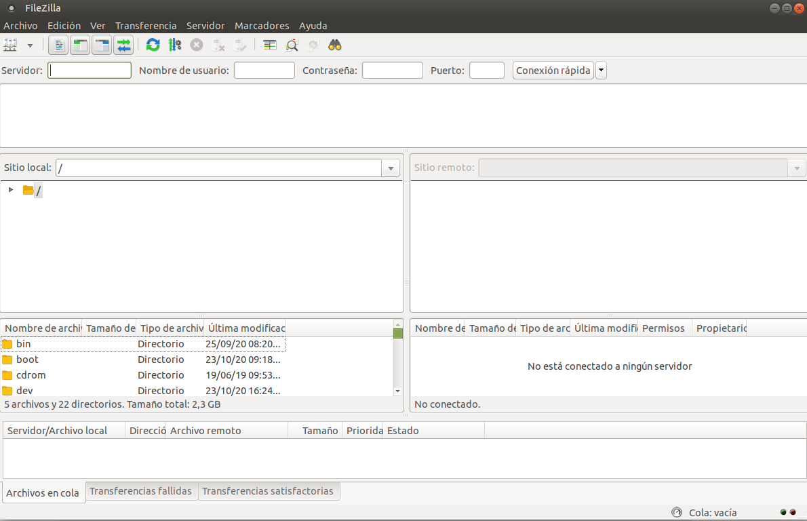
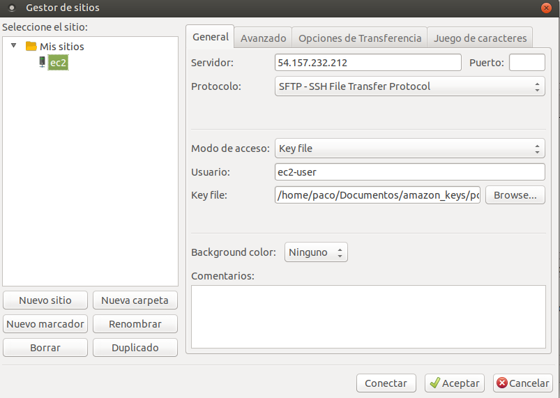

# FileZilla

Pulsar archivo, gestor de sitios...

Pulsar Nuevo sitio:
1. Introducir nombre
2. Introducir IP Servidor y Puerto (22 por defecto)
3. Protocolo: SFTP - SSH File Transfer Protocol
4. Modo de acceso: Key File
5. Usuario: ec2-user

