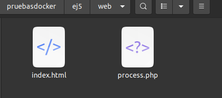
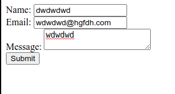
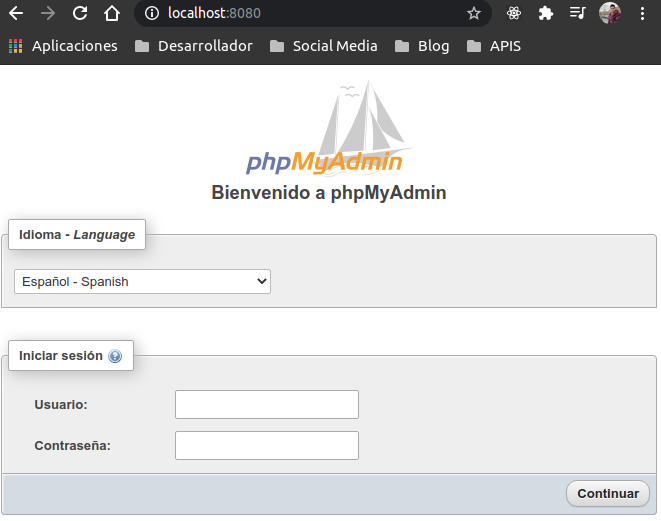
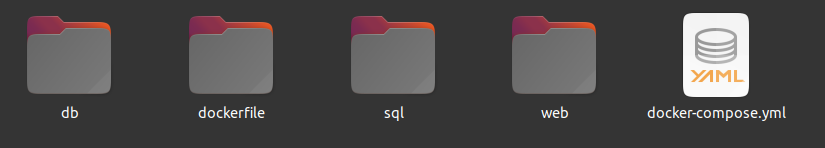

# EJ5

- [EJ5](#ej5)
  - [1 Creación imagen Apache & PHP](#1-creación-imagen-apache--php)
  - [2 Creación servicio PHP](#2-creación-servicio-php)
  - [3 Creación servicio PHPmyadmin](#3-creación-servicio-phpmyadmin)
  - [4 Creacion servicio mariadb](#4-creacion-servicio-mariadb)

## 1 Creación imagen Apache & PHP

1. Como la imagen que necesitamos, debe incluir una extensión, comenzamos crear un archivo `Dockerfile` en el que especificamos la imagen y el comando.
    ~~~
    $ mkdir dockerfile
    $ cd dockerfile
    $ nano Dockerfile

    FROM php:apache
    MAINTAINER soyl3y3nd4@hotmail.com
    RUN docker-php-ext-install mysqli && docker-php-ext-enable mysqli

    ~~~

2. Creamos la imagen con el `Dockerfile` creado.
   ~~~
   $ docker build -t soy3l3y3nd4/apachephp
   ~~~
    El nombre que le hemos especificado a la imagen será el que usaremos en nuestro `docker-compose.yml`.

## 2 Creación servicio PHP

1. Primero creamos un directorio con los archivos anexos (index.html y process.php) llamado **web** y colocamos los archivos dentro.

    

2. Comenzamos a crear nuestro docker-compose.yml. usaremos la imagen creada previamente, le daremos el nombre de apachephp al contenedor y debe estar en l puerto 80. Debemos también de conectarlo a un volumen para enlazarlo a unos archivos locales.
   ~~~
   version: "3"
   services:
     apachephp:
     image: soyl3y3nd4/apachephp
     container_name: apachephp
     ports:
     - 80:80
     volumes:
     - ~/Documentos/pruebasdocker/ej5/web/:/var/www/html
   ~~~

3. Realizamos un `$ docker-compose up` y comprobamos. Debería aparecernos un formulario pero no funcional, ya que falta la base de datos todavía.
   

## 3 Creación servicio PHPmyadmin

1. Ahora agregaremos a nuestro archivo `docker-compose.yml` otro servicio para poder acceder a la base de datos. Debemos de hacerlo en el puerto 8080, con una imagen de phpmyadmin y agregarle una variable de entorno **PMA_HOST** con el valor mariadb.
   ~~~
       version: "3"
   services:
     apachephp:
        image: soyl3y3nd4/apachephp
        container_name: apachephp
        ports:
           - 80:80
        volumes:
           - ~/Documentos/pruebasdocker/ej5/web/:/var/www/html
     phpmyadmin:
        image: phpmyadmin:latest
        ports:
            - 8080:80
        environment:
            PMA_HOST: mariadb
   ~~~
2. Ahora podemos realizar `$ docker-compose up` y accederemos a locaslhost y localhost:8080 para comprobar, si todo ha ido bien tendremos phpmyadmin funcionando, pero sin conexión a BBDD.
   

## 4 Creacion servicio mariadb

1. El servicio se va a llamar **mariadb**.
    ~~~
        mariadb:
            image: mariadb:latest
            volumes:
              - ~/Documentos/pruebasdocker/ej5/db:/var/lib/mysql
            command: --init-file /data/application/init.sql 
    ~~~
2. Debemos de crear un volumen para tener respaldo de las BBDD, el directorio es `/var/lib/mysql` y lo conectaremos a un directorio local llamado `db`, en caso de que el directorio no lo creemos manualmente, lo creará docker si no existe.
    ~~~
    $ mkdir db

    mariadb:
        image: mariadb:latest
        volumes:
        - ~/Documentos/pruebasdocker/ej5/db:/var/lib/mysql
    ~~~
3. Agregaremos también la siguient isntrucción para que la arranque al iniciar: `command: --init-file /data/application/init.sql`. Para que esto funcione hay que indicarle donde va a estar el archivo `init.sql`. Lo haremos mediante un volumen.
    ~~~
     mariadb:
     image: mariadb:latest
     volumes: 
         - ~/Documentos/pruebasdocker/ej5/db:/var/lib/mysql
         - ~/Documentos/pruebasdocker/ej5/sql/init.sql:/data/application/init.sql
     command: --init-file /data/application/init.sql

    ~~~
4. Ahora deberemos de inicializar la variables de entorno `MYSQL_ROOT_USER, MYSQL_ROOT_PASSWORD, MYSQL_DATABASE, MYSQL_USER, MYSQL_PASSWORD`.
    ~~~
    mariadb:
        image: mariadb:latest
        volumes: 
            - ~/Documentos/pruebasdocker/ej5/db:/var/lib/mysql
            - ~/Documentos/pruebasdocker/ej5/sql/init.sql:/data/application/init.sql
        command: --init-file /data/application/init.sql
        environment:
            MYSQL_ROOT_USER: "root"
            MYSQL_ROOT_PASSWORD: "admin"
            MYSQL_DATABASE: "testdb"
            MYSQL_USER: "user"
            MYSQL_ROOT_PASSWORD: "user"
    ~~~
    Debemos de prestar atención a las variables **MYSQL_DATABASE, MYSQL_USER, MYSQL_PASSWORD**, porque esos datos de la conexión deben de ser los mismo que los del archivo process.php

5. Si todo lo hemos realizado correctamente, deberiamos de tener una carpeta estructurada como la siguiente imagen:
   