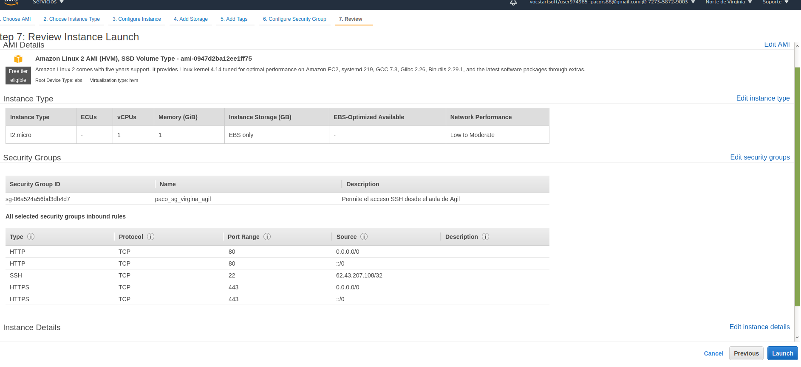
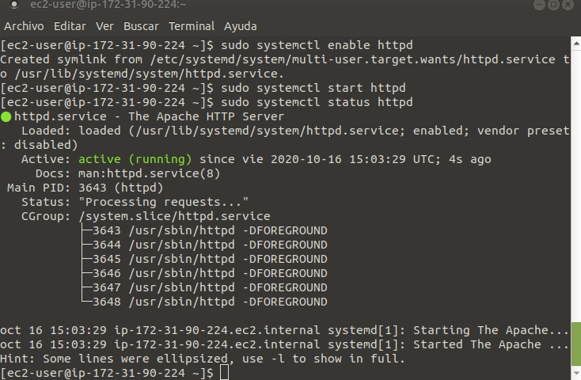
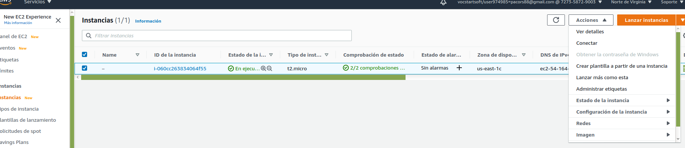
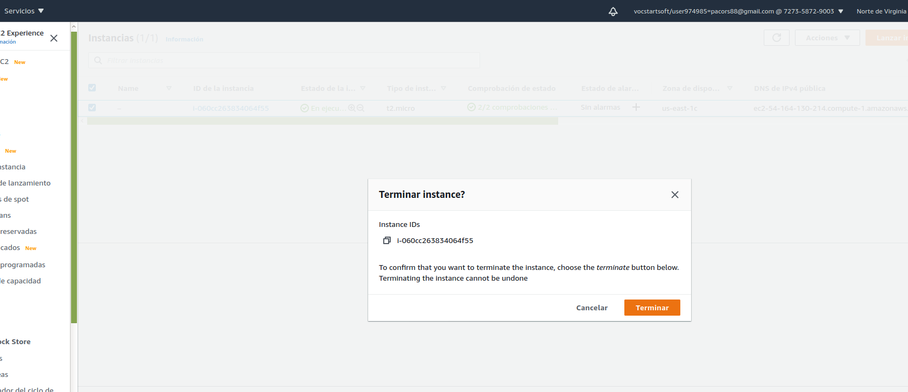
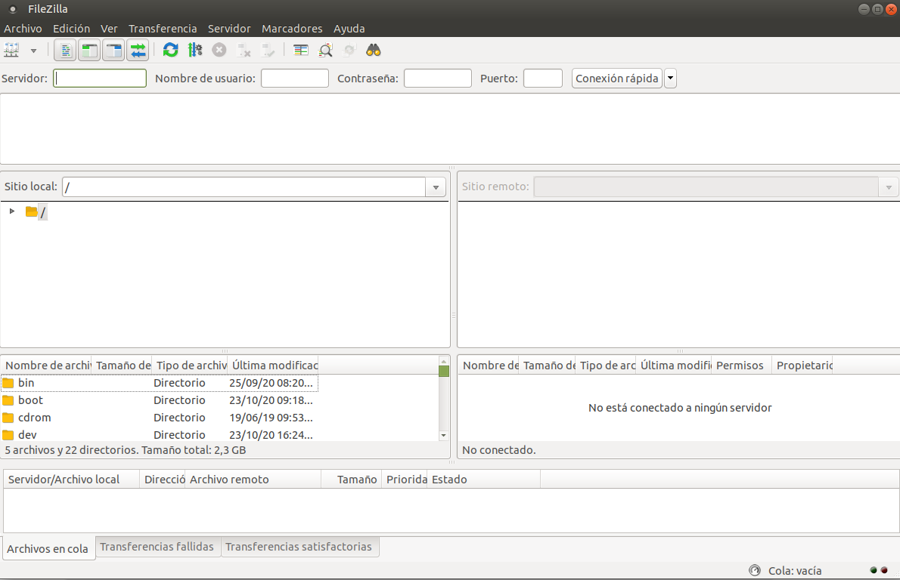

# AWS
 Tutorial EC" en google

 [enlace](https://docs.aws.amazon.com/ec2/index.html)
## **Crear claves**
Desde la instancia, deberemos crear un par de claves.

pem -> Mac o Linux
ppk -> Linux

Guarda la clave en un lugar seguro.

## **Grupos de seguridad**
En los grupos de seguridad, estableceremos reglas para regular que tipo de tráfico va a permitir el servidor.

Los grupos de seguridad vienen dados por zonas, si creamos uno en Virginia, sólo funcionará en Virgina. Por ello al crearlo le pondremos también el nombre de la zona para identificarlo.

### Reglas de entrada
Tipo: HTTP
Origen: Mi ip o cualquier lugar
Tipo: HTTPS
Origen: Mi ip o cualquier lugar
Tipo: SSH
Origen: Mi ip

Si cambia la ip nuestra, no podremos acceder.

Finalizar y Crear grupo de seguridad

## Instancias
Instancias > Lanzar instancia. Las que ponen `Free tier eligible` son gratuitas.
Seleecionamos la que queremos pulsando `Select`.

`Review and Launch` a la máquina que queremos.
Nos llevará a la página de la instancia.
Seleccionamos nuestro grupo de seguridad y en la página de **Review** ya podremos ver el grupo añadido.

Le damos a `Launch` y nos avisa de la clave que hay que elegir, y que sabemos que si perdemos el archivo de la key no podremos acceder a la máquina.

Si todo ha ido correcto, `nos dirá que la Instancia está siendo ejecutada`.

Pasamos a ver las instancias.

Abriremos la consola y con el comando siguiente agregremos nuestro archivo con las keys
`ssh -i /path/my-key-pair.pem my-instance-user-name@my-instance-public-dns-name`

vamos al directorio home de la máquina.

1. Instalar apache
~~~
yum install httpd
~~~
Ver que versión de apache tenemos instalada
~~~
httpd -v
~~~
Ver el estado del servicio
~~~
sudo systemctl status httpd
~~~
Apache escucha un puerto, y en función de lo que le llegue envia la petición al módulo que corresponda y devuelve lo que se esté pidiendo.

Activar apache:
~~~
sudo systemctl enable httpd
~~~

Ejecutar el servicio:
~~~
$ sudo systemctl start httpd
~~~

Comprobamos el stado de apache de nuevo: 
~~~
$ sudo systemctl status httpd
~~~

Introducimos la ip en el navegador `54.164.130.214`, y nos abre la test page de `Apache`.

Acceder al directorio donde se almacenan las webs:
~~~
$ cd /var/www
~~~

Creamos nuestro index.html y creamos nuestra web
~~~
$ cd html
$ sudo nano index.html
~~~

Instalar manual de Apache
~~~
$ sudo yum install httpd-manual
~~~

Acceder
~~~
$ sudo nano /etc/httpd/conf/httpd.conf
~~~

Cerrar sesion de la máquina
~~~
exit
~~~

Pasamos a la página de AWS, seleccionamos la instancia y buscamos la pestaña de acciones:

Estado de la instancia > Terminar instancia

# Preparar el servidor LAMP

1. Conéctese a la instancia.
2. Para asegurarse de que todos los paquetes de software están actualizados, realice una actualización rápida del software en la instancia. Este proceso puede durar unos minutos, pero es importante realizarlo para asegurarse de que tiene las actualizaciones de seguridad y las correcciones de errores más recientes. La opción -y instala las actualizaciones sin necesidad de confirmación. Si le gustaría examinar las actualizaciones antes de la instalación, puede omitir esta opción. 

~~~
$ sudo yum update -y
~~~

3. Instale los repositorios lamp-mariadb10.2-php7.2 y php7.2 Amazon Linux Extras para obtener las versiones más recientes de los paquetes LAMP MariaDB y PHP de Amazon Linux 2.

~~~
$ sudo amazon-linux-extras install -y lamp-mariadb10.2-php7.2 php7.2
~~~

Si recibe el error que indica sudo: amazon-linux-extras: command not found, entonces la instancia no se lanzó con una AMI; de Amazon Linux 2 (quizás está utilizando la Amazon Linux AMI en su lugar). Puede ver la versión de Amazon Linux usando el comando siguiente: 
~~~
$ cat /etc/system-release
~~~

4. Ahora que la instancia está actualizada, puede instalar los paquetes de software PHP, MariaDB y el servidor web Apache. Utilice el comando yum install para instalar varios paquetes de software y todas las dependencias relacionadas al mismo tiempo. 

~~~
$ sudo yum install -y httpd mariadb-server
~~~

5. Inicie el servidor web Apache.

~~~
$ sudo systemctl start httpd
~~~

6. Utilice el comando systemctl para configurar el servidor web Apache de forma que se inicie cada vez que arranque el sistema.

~~~
$ sudo systemctl enable httpd
~~~
Utilice el comando systemctl para configurar el servidor web Apache de forma que se inicie cada vez que arranque el sistema.
~~~
$ sudo systemctl is-enabled httpd
~~~

## Para establecer permisos de archivo

1. Añada el usuario (en este caso, el usuario ec2-user) al grupo apache.
~~~
$ sudo usermod -a -G apache ec2-user
~~~

2. Cerrar sesión.
~~~
$exit
~~~
Volver a conectar a la máquina.
~~~
$ ssh -i pc-agil-centros.pem ec2-user@54.164.130.214
~~~
Verificar si el usuario pertenece al grupo apache

~~~
[ec2-user ~]$ groups
ec2-user adm wheel apache systemd-journal
~~~
3. Cambie la propiedad de grupo de /var/www y su contenido al grupo apache.
~~~
$ sudo chown -R ec2-user:apache /var/www
~~~

4. Para agregar permisos de escritura de grupo y establecer el ID de grupo en futuros subdirectorios, cambie los permisos del directorio /var/www y sus subdirectorios. 

~~~
$ sudo chmod 2775 /var/www && find /var/www -type d -exec sudo chmod 2775 {} \;
~~~

5. Para agregar permisos de escritura de grupo, cambie recursivamente los permisos de archivo de /var/www y sus subdirectorios: 
~~~
$ find /var/www -type f -exec sudo chmod 0664 {} \;
~~~

Si todo está correcto podemos crear un archivo php y acceder a él:
~~~
echo "<?php phpinfo(); ?>" > /var/www/html/phpinfo.php
~~~
Poner en el navegador http://my.public.dns.amazonaws.com/phpinfo.php

# FileZilla

Pulsar archivo, gestor de sitios...

Pulsar Nuevo sitio:
1. Introducir nombre
2. Introducir IP Servidor y Puerto (22 por defecto)
3. Protocolo: SFTP - SSH File Transfer Protocol
4. Modo de acceso: Key File
5. Usuario: ec2-user

